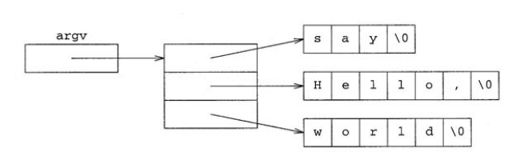

# 10. 메모리 관리 및 저수준 데이터 구조

라이브러리를 사용하는 법을 학습했다면 이에 어떻게 동작하는지 이해해 보자.

라이브러리 동작을 이해하는 핵심 사항은 프로그래밍 언어에 있는 기본 영역의 프로그래밍 도구와 기술을 포함하는 것이며 이러한 개념을 가르치려고 **저수준**이라는 용어를 사용한다.

왜냐면 표준 라이브러리 기반이며, 일반적은 컴퓨터 하드웨어가 동작하는 방식과 밀접하기 때문이다. 따라서 사용하기 어렵고 위험하지만 철저한 이해가 뒷받침 된다면 표준 라이브러리를 사용하는 것보다 효율적일 수 있다.

이 장에서는 배열과 포인터가 어떻게 동작하는지 이해한 후 11장에서 라이브러리가 배열과 포인터를 사용하여 어떻게 컨테이너를 구현하는지 살펴볼 것이다.


## 10.1 포인터와 배열

포인터와 배열은 C 및 C++에서 가장 원시적인 데이터 구조 중하나이다. 두 개념은 서로 분리할 수 없으므로 포인터를 사용하지 않고 배열을 유용하게 다룰 수 없으며, 또한 배열과 함께 사용할 때 훨씬 유용하다.


### 10.1.1 포인터

**포인터**는 객체의 **주소**를 나타내는 값이다. 모든 개별 객체는 주소가 있으며, 해당 주소는 컴퓨터 메모리에 객체가 저장된 부분을 가리킨다. 

객체에 접근할 수 있다면 객체의 주소를 얻을 수 있으며 그 반대도 마찬가지이다. 예를 들어 x가 객체일 따 &x는 객체의 주소고, p가 객체의 주소일 때 *p는 객체 자체이다.

&x에서 &는 **주소 연산자**라고 하며 참조 타입을 정의하는 &의 용도와 다르다.

*는 **역참조 연산자**라고 하며 반복자를 적용해 사용한 *와 비슷한 방식으로 동작한다. 만약 p가 x의 주소가 있다면 p는 x를 카리키는 포인터이다. 이 상태를 그림으로 나타내면 다음과 같다.


다른 기본 타입과 마찬가지로 포인터인 지역 변수는 우리가 값을 할당할 때까지 의미 없는 값을 갖는다. 따라서 초기화하지 않은 포인터는 어디를 가리키는지 알 수 없는 상태이며, 이를 사용하면 잘못된 메모리에 접근할 위험이 있다.

그래서 프로그래머는 포인터를 초기화할 때 흔히 `0`을 사용한다.

```cpp
int* p = 0;
```

여기서 `0`은 단순한 숫자 0이라기보다, “아무 객체도 가리키지 않는다”는 특별한 의미로 포인터에 변환된다. 이렇게 변환된 값은 실제 객체의 주소와 겹치지 않도록 보장되므로, 포인터가 현재 유효한 객체를 가리키고 있는지 안전하게 확인할 수 있다.

또한 C++에서는 정수값 가운데 오직 `0`만 특별히 포인터 타입으로 변환할 수 있다. 이러한 특별한 포인터 값을 null 포인터(null pointer)라고 한다.

요즘 C++에서는 의미를 더 명확하게 나타내기 위해 `0` 대신 `nullptr`을 사용하는 경우가 많다.

```cpp
int* p = nullptr;
```

이 역시 “아무 객체도 가리키지 않는 포인터”를 의미한다.


C++에 존재하는 모든 값과 마찬가지로 포인터는 타입이 있다. T 타입인 객체의 주소는 T포인터  타입이며 T*라고 표기한다.

x를 int 타입 객체로 가정하면 다음처럼 정의할 수 있다.

```c++
int x;
```

그리고 p를 x주소가 있는 타입으로 정의하도록 하자, 즉 p의 타입은 'int 포인터'이며, 이것은 int타입의 *p를 정의하여 간접적으로 나타낼 수 있다.

```c++
int *p; // *p는 int 타입
```

*p는 단일 변수를 정의하는 정의문을 구성하는 **선언자**이며, 해당 선언자는 *와 p로 구성된다. 하지만 대부분 프로그래머는 p에 있는 타입(int *)를 강조하려고 다음처럼 작성한다.

```c++
int* p;
```


지금까지 살펴본 내용을 바탕으로 다음처럼 포인터를 사용하는 간단한 프로그램을 작성해 보자

```c++
int main()
{
    int x = 5;

    // p는 x를 가리킴
	int* p = &x;
	cout << "x = " << x << endl;

	// p를 통해 x의 값을 변경
	*p = 6;
	cout << "x = " << x << endl;

	return 0;
}
```

출력 결과는 다음과 같다

```
x = 5
x = 6
```


p를 정의한 직후 변수들의 상태는 다음과 같다.


첫번째 출력문을 실행했을 때 x가 5이다. 그 다음 실행문에서는 *p = 6을 이용해 x 값을 6으로 바꾼다.

기억해야할 것은 p에 x의 주소가 있으므로 *p와 x를 사용해 같은 객체 하나를 참조할 수 있다.

따라서 두 번째 출력문을 실행했을 때 값은 6이다.


### 10.1.2 함수 포인터

6.2.2에서는 함수 하나를 다른 함수의 인자로 전달하는 프로그램을 살펴보았다. 그런데 실제로는 눈에 보이는 것보다 조금 더 복잡한 일이 일어나고 있다.

사실 함수는 일반 객체(object)가 아니다.  따라서 변수처럼 복사(copy)하거나 대입(assign)할 수 없고, 함수 자체를 직접 인자로 전달할 수도 없다

그럼에도 6.2.2에서 

```c++
write_analysis(median_analysis);
```

처럼 함수 이름을 인자로 넘기는 코드를 보면 마치 함수를 그대로 전달하는 것처럼 보이지만, 실제로는 그렇지 않다.

함수는 프로그램이 새로 만들거나 수정할 수 있는 대상이 아니다. 함수의 생성과 관리에는 컴파일러가 관여한다.
프로그램이 함수에 대해 할 수 있는 일은 다음 두 가지뿐이다.

- 함수를 호출(call)하기
- 함수의 주소(address)를 얻기

그렇다면 어떻게 함수를 다른 함수의 인자로 넘길 수 있을까?

컴파일러가 이런 코드를 조용히 변환하기 때문이다.

즉:

```c++
write_analysis(median_analysis);
```

를 내부적으로는:

```
“median_analysis 함수 자체”
```

가 아니라

```
“median_analysis 함수의 주소”
```

로 전달하는 형태로 바꾼다. 즉 함수 포인터를 전달하는 것이다.


함수 포인터 선언자는 다른 선언자와 비슷하다. 예를 들어 *p가 int 타입이란걸 나타내려면 이렇게 작성한다.

```c++
int* p;
```

이는 p가 포인터임을 의미한다. 따라서 fp를 역참조하여 int 타입의 인수를 호출하여 int 타입의 결과를 반환할 때는 다음처럼 작성할 수 있다.

```c++
int (*fp)(int);
```

이는 fp가 int 타입의 인수로 int 타입의 결과를 반환하는 함수 포인터임을 의미한다.


우리가 할 수 있는 것은 함수 주소를 얻거나 함수를 호출하는 것뿐이므로 호출을 제외한 함수 사용에서 &를 명시하지 않더라도 해당 함수의 주소를 얻는 것으로 간주한다. 마찬가지로 포인터를 명시적으로 역참조하지 않더라도 함수 포인터를 호출할 수 있다. 다음처럼 fp 타입이 일치하는 함수를 가정해 보자

```c++
int next(int n)
{
	return n + 1;
}
```


그리고 다음 두 실행문 가운데 하나를 사용하면 fp가 next를 가리키게 만들 수 있다.

```c++
fp = next; // fp는 next 함수를 가리킴
fp = &next; // fp는 next 함수를 가리킴
```


마찬가지로 i가 int 타입 변수일 때 다음 두 실행문 중 하나를 사용하면 fp로 next를 호출하여 i를 증가시킬 수 있다.

```c++
i = fp(i);
i = (*fp)(i); 
```


마지막으로, 함수가 다른 함수를 매개변수로 받는 것처럼 보이는 경우에도 실제로는 함수 자체가 전달되는 것이 아니라 함수 포인터가 전달된다. 컴파일러가 이를 자동으로 함수 포인터 형태로 변환해 주기 때문이다.

예를 들어 6.2.2의 `write_analysis` 함수에서 다음과 같이 작성한 매개변수는

```c++
double analysis(const vector<Student_info>&)
```

실제로는 다음과 같은 의미이다.

```c++
double (*analysis)(const vector<Student_info>&)
```

즉 `analysis`는 함수 자체가 아니라, `const vector<Student_info>&`를 인자로 받아 `double`을 반환하는 함수의 주소를 저장하는 함수 포인터이다.

다만 이러한 자동 변환은 함수의 매개변수에서만 적용된다. 함수를 반환값으로 사용할 때는 컴파일러가 자동으로 함수 포인터로 바꿔주지 않기 때문에, 함수 포인터 타입을 직접 명시해야 한다.

예를 들어 다음과 같이 typedef를 사용하면

```c++
typedef double (*analysis_fp)(const vector<Student_info>&);
```

`analysis_fp`라는 이름을 “`const vector<Student_info>&`를 받아 `double`을 반환하는 함수의 포인터 타입”으로 사용할 수 있다.

이제 이를 이용해 함수 포인터를 반환하는 함수를 다음처럼 간단하게 선언할 수 있다.

```c++
analysis_fp get_analysis_ptr();
```

이 선언은 “`get_analysis_ptr` 함수는 analysis 함수 타입의 포인터를 반환한다”는 뜻이다.

반대로 typedef를 사용하지 않으면 다음과 같이 작성해야 한다.

```c++
double (*get_analysis_ptr())(const vector<Student_info>&);
```

문법이 매우 복잡하고 읽기 어렵기 때문에, 실제로는 typedef나 using을 사용해 함수 포인터 타입에 별칭을 붙여 사용하는 경우가 많다.


함수 포인터를 가장 흔히 사용하는 예는 다른 함수의 인수로 사용할 때이다. 예를 들어 라이브러리 함수인 find_if의 구현을 살펴보자

```c++
template<class In, class Pred>
In find_if(In begin, In end, Pred f)
{
    while (begin != end && !f(*begin))
        ++begin;

    return begin;
}
```

여기서 `Pred`는 특별한 타입이 아니라, `f(*begin)`처럼 호출할 수 있기만 하면 어떤 타입이든 사용할 수 있다.

예를 들어 다음과 같은 조건 함수(predicate function)가 있다고 하자.

```
bool is_negative(int n)
{
    return n < 0;
}
```

이 함수는 숫자가 음수이면 `true`, 아니면 `false`를 반환한다.

이제 `vector<int>`인 `v`에서 첫 번째 음수를 찾기 위해 다음과 같이 사용할 수 있다.

```
vector<int>::iterator i =
    find_if(v.begin(), v.end(), is_negative);
```

여기서 `is_negative` 뒤에 `()`를 붙이지 않은 이유는 함수를 실행하려는 것이 아니라, 함수 자체를 전달하려는 것이기 때문이다. 실제로는 함수의 이름이 자동으로 함수 포인터로 변환되어 전달된다.

마찬가지로 `find_if` 내부에서 사용한

```
f(*begin)
```

도 사실은 함수 포인터를 통해 함수를 호출하는 코드이다. 원래는 `(*f)(*begin)`처럼 작성할 수도 있지만, C++이 자동으로 처리해 주기 때문에 더 간단하게 쓸 수 있다


## 10.1.3 배열

**배열(array)**은 표준 라이브러리에 포함된 컨테이너가 아니라, C++ 언어 자체에 포함된 기본 기능이다. 배열에는 같은 타입의 객체들이 순서대로 저장된다. 또한 배열의 크기(원소 개수)는 반드시 컴파일 시점에 결정되어 있어야 한다. 따라서 vector 같은 라이브러리 컨테이너와 달리, 배열은 실행 중에 크기를 늘리거나 줄일 수 없다.

배열은 클래스 타입이 아니기 때문에 멤버 함수나 멤버 타입이 없다. 예를 들어 vector에는 크기를 나타낼 때 사용하는 `size_type`이 있지만, 배열에는 그런 것이 없다. 대신 `<cstddef>` 헤더에서 제공하는 `size_t` 타입을 사용한다. `size_t`는 객체의 크기나 배열의 크기를 저장하기에 충분한 크기의 부호 없는 정수(unsigned integer) 타입이다.

예를 들어 3차원 공간의 좌표를 저장하려면 다음처럼 배열을 사용할 수 있다.

```c++
double coords[3];
```

이 코드는 `double` 값 3개를 저장하는 배열을 만든다. 보통 x, y, z 좌표를 저장하는 용도로 생각할 수 있다.

하지만 숙련된 프로그래머는 보통 숫자 `3`을 직접 쓰기보다 다음처럼 작성한다.

```c++
const size_t NDim = 3;
double coords[NDim];
```

이렇게 하면 코드의 의미가 더 분명해진다. 여기서 `NDim`은 “차원의 개수(number of dimensions)”를 의미한다. 즉 단순한 숫자 3이 아니라 “이 배열은 3차원 좌표를 저장한다”는 의미를 코드에 담을 수 있다.

또한 `NDim`은 `const size_t` 상수이므로 컴파일 시점에 값이 이미 결정되어 있다. 배열 크기는 컴파일 시점에 알아야 하기 때문에 이런 방식으로 사용할 수 있다.

배열과 포인터 사이에는 매우 중요한 관계가 있다. 배열 이름을 값처럼 사용하면, 실제로는 배열의 첫 번째 원소를 가리키는 포인터로 변환된다.

예를 들어:

```
double coords[3];
```

에서 `coords`는 배열 이름이지만, 값처럼 사용하면:

```
coords == &coords[0]
```

와 비슷하게 동작한다. 즉 배열의 첫 번째 원소 주소를 의미한다.

따라서 포인터처럼 `*` 연산자를 사용할 수 있다.

```
*coords = 1.5;
```

이 코드는 배열의 첫 번째 원소에 1.5를 저장한다. 즉 실제 의미는 다음과 같다.

```
coords[0] = 1.5;
```


### 10.1.4 포인터 연산

이제 우리는 배열을 정의하는 방법과 배열의 첫 번째 원소 주소를 얻는 방법을 알고 있다. 또한 배열 이름을 값처럼 사용하면 첫 번째 원소를 가리키는 포인터로 변환된다는 것도 보았다. 더 구체적으로 말하면, 포인터는 배열의 원소를 가리키는 경우 “포인터 연산(pointer arithmetic)”을 사용할 수 있다.

배열과 포인터에는 중요한 관계가 있다. 만약 포인터 `p`가 배열의 m번째 원소를 가리키고 있다면:

```c++
p + n
```

은 배열의 `(m + n)`번째 원소를 가리킨다.

반대로:

```c++
p - n
```

은 `(m - n)`번째 원소를 가리킨다.

물론 그런 원소가 실제로 존재해야 한다. 예를 들어 이전에 정의한 배열:

```c++
double coords[3];
```

배열 이름 `coords`는 첫 번째 원소 주소를 의미하므로:

```txt
coords == &coords[0]
```

이며,

```cpp
coords + 1
```

은 두 번째 원소 주소를 의미한다.

```cpp
coords + 2
```

는 세 번째 원소 주소를 의미한다.

이 배열은 원소가 3개뿐이므로 이것이 마지막 원소이다.

그렇다면:

```cpp
coords + 3
```

은 무엇일까?

이 값은 “존재하지 않는 네 번째 원소가 있었을 위치”를 나타낸다. 즉 실제 원소를 가리키지는 않는다.

그런데 흥미롭게도 `coords + 3`은 유효한 포인터이다. 비록 실제 원소를 가리키지는 않지만, 배열의 끝 바로 다음 위치를 나타내는 특별한 값으로 사용할 수 있다.

C++에서는 배열이나 컨테이너의 “끝 다음 위치(one past the end)”를 나타내는 포인터나 iterator를 자주 사용한다.

예를 들어 배열 내용을 vector에 복사할 수 있다.

```c++
vector<double> v;

copy(coords, coords + NDim, back_inserter(v));
```

여기서 `NDim`은 3이다.

즉:

```cpp
copy(coords, coords + 3, ...)
```

와 같다.

이 코드는:

```txt
coords부터 시작해서
coords + 3 직전까지
```

원소를 복사하라는 뜻이다.

중요한 점은 `coords + 3`이 실제 원소는 아니지만, “끝 위치”를 나타내는 용도로는 완전히 정상이라는 것이다.

마찬가지로 vector는 두 iterator를 이용해 생성할 수 있으므로 다음처럼도 작성할 수 있다.

```cpp
vector<double> v(coords, coords + NDim);
```

즉 배열 전체 내용을 vector로 복사해서 초기화하는 코드이다.

배열을 표준 라이브러리 알고리즘과 함께 사용할 때는 배열 이름과 끝 위치를 넘겨주면 된다. 예를 들어 vector에서는:

```cpp
v.begin(), v.end()
```

를 사용하지만 배열에서는:

```cpp
a, a + n
```

형태를 사용한다.

즉:

```txt
배열 시작 주소
배열 끝 다음 주소
```

를 전달하는 것이다.

또한 두 포인터를 빼는 것도 가능하다.

만약 `p`와 `q`가 같은 배열의 원소를 가리키는 포인터라면:

```cpp
p - q
```

는 두 원소 사이의 거리(원소 개수 차이)를 의미한다.

예를 들어:

```cpp
coords + 2 - coords
```

는 결과가 2이다.

즉 첫 번째 원소에서 세 번째 원소까지 두 칸 떨어져 있다는 뜻이다.

마지막으로, 배열의 시작 이전 위치를 가리키는 포인터는 만들 수 없으며 사용해서도 안 된다.

배열 `a`가 원소 n개를 가진다면:

```cpp
a + i
```

는 다음 조건에서만 유효하다.

```txt
0 <= i <= n
```

즉 마지막 원소 다음 위치(`i == n`)까지는 허용되지만, 그보다 더 뒤나 배열 시작 이전은 허용되지 않는다.


### 10.1.5 인덱싱

10.1에서 언급했듯이 포인터는 임의 접근 반복자이다. 따라서 포인터는 임의 접근 반복자와 마찬가지로 인덱스를 사용할 수 있다.

예를 들어 p가 m번째 요소를 카리키는 포인터라면 p[n]은 배열의 m+n번째 요소이다. 이때 p[n]은 요소의 주소가 아닌 요소 그 자체이다.

10.1.3에서 살펴본 것처럼 배열 이름은 배열 첫번째 요소의 주소이다. 즉 p[n]을 정의했고 배열 a가 있다면 a[n]이 배열의 n번째 요소임을 의미한다. p가 포인터이고 n이 정수일 때 p[n]은 *(p + n)과 같은 의미이다.


### 10.1.6 배열 초기화

배열은 표준 라이브러리 컨테이너와 구분되는 중요한 속성이 있다. 배열의 각 요소에 초깃값을 할당할 수 있다는 것이다.

초기값을 할당하면 배열의 크기를 명시하지 않아도 된다.

예를 들어 날짜를 다루는 프로그램을 작성할 때 월별 일수는 다음과 같은 방법으로 저장할 수 있다.

```c++
const int month_length[] = { 31, 28, 31, 30, 31, 30, 31, 31, 30, 31, 30, 31 };
```

월별 일수를 초기값으로 삼아 요소를 할당했다. 1월의 요소 번호는 0이고 12월의 요소 번호는 11이다.

이제 month-length[i]를 사용하여 i월의 일수를 나타낼 수 있다.

이때 배열의 요소 개수를 명시하지 않았다. 배열을 명시적으로 초기화하였으므로 컴파일러가 우리를 대신하여 요소 개수를 구한다.


## 10.2 문자열 리터럴 다시 살펴보기

문자열 리터럴의 의미를 다시 이해해 보자. 실제 문자열 리터럴은 리터럴의 문자 개수보다 하나 더 많은 요소가 있는 const char 배열이다. 추가된 문자 하나는 null문자('\n')이다. 컴파일러가 문자열의 마지막에 자동으로 추가한다.

다음 코드를 예를 들어보자

```c++
const char hello[] = { 'H','e','l','l','o' }
```

변수 hello는 문자열 리터럴 'Hello'와 정확히 같다. 물론 변수와 리터럴은 별개의 객체이므로 서로 다른 주소를 갖는다.

컴파일러가 null문자를 삽입하는 이유는 프로그래머가 첫 문자의 주소만 주어진 리터럴의 끝을 찾을 수 있도록 하려는 것이다.

null 문자는 끝을 표시하려는 역할이므로 프로그래머는 문자열이 끝나는 위치를 알 수 있다.


<cstring>헤더에는 strlen이라는 라이브러리 함수가 있다. strlen함수는 문자열 리터럴 또는 null 문자로 끝나는 문자 배열에 있는 문자 개수를 알려주며 마지막 null문자는 개수로 세지 않는다. strlen은 다음과 같은 형태로 구현되어 있다.

```c++
size_t strlen(const char* s)
{
	size_t count = 0;
	while (*s++ != '\0')
		++count;
	return count;
}
```

10.1.3에서 살펴본 것처럼 size_t는 부호 없는 정수 타입이므로 어떠한 크기의 배열도 담을 수 있으므로 변수 size 타입으로 적절하다. strlen 함수는 배열 p에서 null문자를 제외한 문자 개수를 반환한다.


변수 hello는 문자열 리터럴 "Hello"와 같은 의미이므로 다음 코드를 이용해 변수 hello에 저장된 문자들의 복사본이 있는 문자열 변수 s를 정의할 수 있다.

```c++
string s(hello);
```

방금 설명한 문자열 변수 s를 정의하는 코드는 다음과 같다.

```c++
string s("Hello");
```

또한 반복자 2개로 문자열을 만들 수 있으므로 다음처럼 코드를 작성할 수 있다.

```c++
const char hello[] = { 'H','e','l','l','o' };
string s(hello, hello + strlen(hello));
```

매개변수 hello는 배열 hello의 첫 번째 문자를 가리키는 포인터고 hello + strlen(hello)는 배열의 마지막이자 배열 hello의 요소 가운데 o 다음 문자인 '\n'을 가리키는 포인터이다.

6.1.1에서 살펴본 반복자 2개로 새로운 문자열 만들기 처럼 포인터 2개로 문자열을 만들 수 있다. 두 가지 방법 모두 첫 번째 반복자는 우리가 만들려는 문자열의 초기화에 사용할 순차열의 첫 번째 문자를 참조한다. 두번째 반복자는 마지막 문자의 다음 요소를 참조한다.


## 10.3 문자 포인터 배열의 초기화

문자열 리터럴은 마지막에 null 문자가 붙어 있는 문자 배열이고, 보통 첫 번째 문자의 주소처럼 사용할 수 있다.
 그리고 배열은 `{ }` 안에 여러 값을 넣어서 초기화할 수 있다.
 따라서 여러 문자열 리터럴의 시작 주소들을 `{ }` 안에 넣으면, 문자열들을 가리키는 문자 포인터 배열을 만들 수 있다.

구체적으로 예를 들어 보자. 다음 규칙에 따라 숫자로된 최종 점수를 문자 등급으로 변환할 때를 생각해 보자.

| 최종 점수 | 97   | 94   | 90   | 87   | 84   | 80   | 77   | 74   | 70   | 60   | 0    |
| --------- | ---- | ---- | ---- | ---- | ---- | ---- | ---- | ---- | ---- | ---- | ---- |
| 문자 등급 | A+   | A    | A-   | B+   | B    | B-   | C+   | C    | C-   | D    | F    |

이렇게 점수를 문자 등급으로 변환하는 프로그램은 다음과 같다.

```c++
string letter_grade(double grade)
{
	// 각 범위를 구분하는 점수
	static const double numbers[] = { 97,94,90,87,84,80,77,74,70,60,0 };

	// 각 범위에 대응하는 학점
	static const char* const letters[] = { "A+","A","A-","B+","B","B-","C+","C","D+","D","F" };

	// 배열 크기와 요소 하나의 크기를 사용하요 각 범위를 구분하는 점수 개수를 구함
	static const size_t ngrades = sizeof(numbers) / sizeof(*numbers);

	// 주어진 최종 점수에 해당하는 문자 등급을 찾아서 반환
	for (size_t i = 0; i < ngrades; ++i) {
		if (grade >= numbers[i])
			return letters[i];
	}
	return "?\?\?";
}
```

배열 numbers의 정의문에서는 static을 사용한다. 여기서 사용한 static은 배열 letters와 배열 numbers를 사용하기 전 단 한번만 초기화 하도록 컴파일러에게 지시한다.

배열 요소가 const인 것은 배열 요소를 바꿀 의도가 없다는 뜻이며 따라서 const를 사용하여 배열을 단 한번만 초기화 하고 다음 과정을 실행할 수 있다.

배열 letters는 const char 타입을 가리키는 상수 포인터 배열이다. 배열 각 요소는 문자 등급에 해당하는 각 문자열 리터럴의 첫 번째 요소를 가리킨다.

ngrades의 정의문에는 새롭게 등장한 sizeof를 사용한다. sizeof는 배열 numbers에 있는 요소 개수를 알고자 할때 직접 개수를 세는 수고를 더는데 사용된다.

e가 표현식일 때 sizeof(e)는 size_t 타입 값을 반환하며 이 값은 e와 같은 타입인 객체가 차지하는 메모리 크기를 나타낸다. 결과는 byte로 나타내고 바이트는 저장 공간의 단위고 구현체마다 형태가 조금씩 다르다.

바이트에 관해 확실히 보장할 수 있는 것은 1byte는 8bit로 구성되고 모든 객체는 적어도 1byte를 차지한다는 것이다.

그리고 char 타입은 정확히 1바이트를 차지한다.

우리가 원하는 것은 numbers가 차지하는 바이트 크기가 아닌 배열에 있는 요소 개수이다. 이를 확인하려고 배열 전체 크기를 단일 요소 크기로 나눌 것이다. numbers가 뱅ㄹ이면 *numbers는 배열 요소이다.

*numbers는 배열의 첫번째 요소이디만 배열에 있는 모든 요소의 크기는 같으므로 특별히 해당 요소와 관련이 있지 않다. sizeof(*numbers) / sizeof(*numbers)는 배열의 요소 개수이다.

그 다음엔 배열 numbers의 요소를 순차적으로 탐색하여 grade보다 작거나 같은 요소를 찾은 후 대응하는 배열 letters의 요소를 반환한다. 반환하는 요소는 포인터이며 10.2에서 살펴본 것처럼 문자 포인터는 문자열로 변환할 수 있다.

만약 알맞은 문자 등급을 못 찾는다면 최종 점수가 음수일 때이다. 이때는 물음표 3개를 반환한다. \문자열을 사용하는 이유는 C++ 프로그램이 2개 이상의 연속적인 물음표를 포함하면 안되기 때문이다.


## 10.4 main 함수의 인수

포인터와 문자 배열을 이해했다면 main 함수에 인수를 전달하는 방법을 이해할 수 있다.

운영체제 대부분은 일련의 문자열을 main 함수의 인수로 전달하는 방법을 제공한다. 따라서 main 함수에 2개의 매개변수로 int와 char 더블 포인터가 있어야 한다. 이들은 다른 매개변수와 마찬가지로 임의로 이름을 정할 수 있지만 보통 argc와 argv로 나타낸다. 

argv는 포인터배열의 첫 번째 요소를 가리키는 포인터, argc의 값은 argv가 가리키는 포인터 배열의 요소 개수이다.

해당 배열에 요소가 존재하면 배열의 첫 번째 요소는 호출된 프로그램의 이름이다. 인수의 위치는 그 다음 요소이다.

예를 들어 main 함수로 전달된 인수가 존재할 때 해당 인수들을 공백으로 구분하여 출력하는 프로그램은 다음과 같다.

```c++
int main(int argc, char** argv)
{
	// 명령 프롬프트에 입력한 인수가 존재하면 출력
	if (argc > 1) {
		int i;
		for (i = 1; i < argc-1; ++i)
			cout << argv[i] << " ";
		cout << argv[i] << endl;
	}
	return 0;
}
```

이 프로그램을 컴파일하여 say라는 실행파일에 넣어 실행한 후 명령 프롬프트에 다음 내용을 입력해보자

```
say hello, world!
```

그럼 다음 결과를 출력한다.

```
hello, world!
```

이때 argc는 3이고 argv의 세가지 요소는 각각 say, Hello, world로 초기화된 배열의 첫 번째 문자를 가리키는 포인터이다.

argv 값을 그림으로 나타내면 다음과 같다.




## 10.5 파일 읽기 및 쓰기

이 책에 나오는 프로그램들은 지금까지 입력을 받을 때는 `cin`을 사용하고, 결과를 출력할 때는 `cout`을 사용하는 방식만 다루어 왔다.

하지만 실제로 규모가 더 큰 프로그램을 만들다 보면, 하나의 입력만 처리하거나 하나의 출력만 만들어 내는 것이 아니라, 여러 개의 파일에서 데이터를 읽어 오거나, 처리한 결과를 여러 개의 파일로 나누어 저장해야 하는 경우가 자주 생긴다.

C++은 이러한 상황에서 프로그램이 여러 파일을 입력과 출력 대상으로 사용할 수 있도록 다양한 기능을 제공하며, 이 절에서는 그 기능들 중에서 기본적으로 알아 두어야 할 몇 가지 내용만 살펴볼 것이다.


### 10.5.1 표준 에러 스트림

프로그램을 작성하다 보면, 프로그램이 실행되는 동안 현재 어떤 작업을 수행하고 있는지, 또는 실행 중에 어떤 문제가 발생했는지를 사용자나 개발자에게 알려 주는 메시지를 출력해야 할 때가 있다.

예를 들어 프로그램이 파일을 읽고 있다면 “파일을 읽는 중입니다”와 같은 진행 상황 메시지를 출력할 수 있고, 파일을 열지 못했다면 “파일을 열 수 없습니다”와 같은 오류 메시지를 출력할 수 있다.

하지만 이러한 메시지들은 프로그램이 최종적으로 만들어 내야 하는 일반적인 출력 결과와는 성격이 다르기 때문에, 실제 결과값과 같은 출력으로 섞여 버리면 안 된다.

예를 들어 어떤 프로그램의 목적이 계산 결과로 숫자 `85`를 출력하는 것이라면, 이 프로그램의 일반적인 출력 결과는 `85` 하나라고 볼 수 있다.

반면 “파일을 읽는 중입니다”나 “파일을 열 수 없습니다” 같은 문장은 프로그램의 계산 결과가 아니라, 프로그램이 실행되는 과정에서 현재 상태나 문제 상황을 설명하기 위해 출력하는 부가적인 메시지이다.

이런 부가적인 메시지가 일반적인 출력 결과와 함께 섞여 버리면, 사람이 화면으로 볼 때는 큰 문제가 없어 보일 수 있지만, 다른 프로그램이 그 출력을 입력으로 받아서 처리하는 경우에는 예상하지 못한 문자열이 섞이게 되어 문제가 발생할 수 있다.

이러한 메시지들을 일반 출력과 쉽게 구분할 수 있도록 하기 위해, C++ 라이브러리는 표준 입력 스트림과 표준 출력 스트림에 더해서 **표준 에러 스트림**이라는 별도의 출력 스트림을 제공한다.

표준 에러 스트림은 프로그램의 일반적인 결과를 출력하기 위한 용도가 아니라, 오류 메시지나 실행 상태 메시지처럼 일반 출력 결과와 분리해서 다루는 것이 더 적절한 내용을 출력하기 위한 용도로 사용된다.

이 스트림은 보통 화면에서는 표준 출력과 함께 보이기 때문에 사용자가 보기에는 `cout`으로 출력한 내용과 크게 다르지 않아 보일 수 있지만, 대부분의 운영체제나 실행 환경에서는 표준 출력과 표준 에러 출력을 서로 다른 대상으로 보내거나 따로 저장할 수 있는 방법을 제공한다.

C++ 프로그램에서 표준 에러 스트림에 메시지를 출력하려면 `cerr` 또는 `clog`를 사용할 수 있다.

이 두 스트림은 모두 일반적인 출력 결과가 아니라 에러 메시지나 로그 메시지처럼 별도로 구분해서 다루고 싶은 내용을 출력할 때 사용하며, 기본적으로 같은 출력 대상에 연결되어 있다.

다만 `cerr`와 `clog`는 출력 내용을 언제 실제로 내보내는지, 즉 **버퍼링**을 어떻게 처리하는지에서 차이가 있다.

`clog` 스트림은 이름에서 알 수 있듯이 프로그램의 실행 기록이나 진행 상황을 남기기 위한 로그 출력에 적합한 스트림이다.

따라서 `clog`는 `cout`과 비슷하게 동작하며, 출력할 문자가 생길 때마다 바로바로 화면에 내보내기보다는, 시스템이 출력하기에 적절하다고 판단할 때까지 잠시 모아 두었다가 한 번에 출력할 수 있다.

반면 `cerr` 스트림은 오류 메시지처럼 사용자가 가능한 한 빨리 확인해야 하는 내용을 출력하기 위한 스트림이기 때문에, 출력할 내용이 생기면 버퍼에 오래 모아 두지 않고 즉시 출력하려고 한다.

이러한 방식 덕분에 `cerr`를 사용하면 오류나 긴급한 문제 상황을 빠르게 화면에 보여 줄 수 있지만, 매번 즉시 출력하려고 하기 때문에 `clog`처럼 모아서 출력하는 방식보다 약간의 추가적인 처리 비용이 발생할 수 있다.

따라서 프로그램 실행 중에 즉시 알려야 하는 긴급한 오류 메시지를 출력할 때는 `cerr`를 사용하는 것이 좋고, 프로그램이 어떤 작업을 수행하고 있는지에 대한 진행 상황이나 실행 기록을 남기고 싶을 때는 `clog`를 사용하는 것이 적절하다.


### 10.5.2 여러 개 입출력 파일 다루기

지금까지는 입력을 받을 때 `cin`을 사용하고, 결과를 출력할 때 `cout`을 사용했다.

하지만 실제 프로그램에서는 키보드에서만 입력을 받거나 화면에만 출력하는 것이 아니라, 파일에서 데이터를 읽어 오거나 파일에 결과를 저장해야 하는 경우가 많다.

예를 들어 `in.txt`라는 파일에서 내용을 읽어 와서, 처리한 결과를 `out.txt`라는 파일에 저장하는 식이다.

이때 사용하는 것이 파일 입력 스트림과 파일 출력 스트림이다.

표준 입력, 표준 출력, 표준 에러 스트림은 항상 파일과 연결되어 있는 것은 아니다.

예를 들어 윈도우 환경에서는 `cin`, `cout`, `cerr` 같은 스트림이 실제 파일이 아니라 프로그램이 실행되는 창과 연결되어 있을 수 있다.

즉, `cout`으로 출력하면 디스크에 있는 파일에 저장되는 것이 아니라 화면에 보이고, `cin`으로 입력하면 파일에서 읽는 것이 아니라 키보드나 실행 창에서 입력을 받는 식이다.

그래서 C++ 표준 라이브러리는 화면이나 키보드와 연결된 표준 스트림과, 디스크에 있는 파일을 읽고 쓰기 위한 파일 스트림을 구분해서 제공한다.

파일에서 입력을 받고 싶다면 `ifstream` 객체를 만들어야 하고, 파일에 출력하고 싶다면 `ofstream` 객체를 만들어야 한다.

여기서 `ifstream`은 input file stream의 줄임말로, 파일에서 데이터를 읽어 오는 스트림이라고 생각하면 된다.

반대로 `ofstream`은 output file stream의 줄임말로, 데이터를 파일에 써 넣는 스트림이라고 생각하면 된다.

처음 보면 `cin`은 `istream`이고 파일 입력은 `ifstream`이니까, 둘을 완전히 다르게 다뤄야 할 것처럼 느껴질 수 있다.

하지만 실제로는 그렇게 복잡하지 않다.

C++ 표준 라이브러리는 `ifstream`이 `istream`처럼 동작할 수 있도록 만들어 두었다.

즉, 원래 `istream`을 받도록 만들어진 함수나 코드에서도 `ifstream`을 사용할 수 있다.

마찬가지로 `ofstream`도 `ostream`처럼 동작할 수 있도록 만들어져 있다.

그래서 원래 `ostream`을 받도록 만들어진 함수나 코드에서도 `ofstream`을 사용할 수 있다.

쉽게 말하면, `cin`과 `ifstream`은 입력을 받는 방식이 비슷하고, `cout`과 `ofstream`은 출력하는 방식이 비슷하다.

차이는 어디에서 입력을 받고 어디로 출력하느냐이다.

`cin`은 보통 키보드나 실행 창에서 입력을 받고, `ifstream`은 파일에서 입력을 받는다.

`cout`은 보통 화면에 출력하고, `ofstream`은 파일에 출력한다.

이 기능을 사용하려면 `<fstream>` 헤더를 포함해야 한다.

`ifstream`이나 `ofstream` 객체를 만들 때는 어떤 파일을 사용할 것인지 파일 이름을 알려 주어야 한다.

예를 들어 다음처럼 쓸 수 있다.

```
ifstream infile("in.txt");
ofstream outfile("out.txt");
```

여기서 `"in.txt"`는 읽어 올 파일 이름이고, `"out.txt"`는 저장할 파일 이름이다.

파일을 읽고 쓰려면 `cin`, `cout` 대신 파일용 스트림인 `ifstream`, `ofstream`을 사용하면 된다.

`ifstream`은 파일에서 읽는 입력 스트림이고, `ofstream`은 파일에 쓰는 출력 스트림이다.

그리고 이 둘은 각각 `istream`, `ostream`처럼 동작할 수 있기 때문에, 기존에 `cin`, `cout`을 사용하던 방식과 거의 비슷하게 사용할 수 있다.

예를 들어 이 절에서는 `in`이라는 파일에서 내용을 읽어서 `out`이라는 파일로 복사하는 프로그램을 살펴본다.

```c++
int main(int argc, char** argv)
{
	ifstream infile("in");
	ofstream outfile("out");

	string s;

	while(getline(infile,s))
	{
		outfile << s << endl;
	}

	return 0;
}
```

마지막으로 main 함수의 인수로 전달한 이름의 파일 안 모든 내용을 복사하여 표준 출력으로 처리하는 프로그램을 살펴보자

```c++
int main(int argc, char** argv)
{
	int fail_count = 0;

	// 주어진 각 파일에 동작을 실행
	for (int i = 1; i < argc; ++i) {
		ifstream in(argv[i]);

		// 파일이 존재하면 해당 파일의 내용을 출력하고
		// 그렇지 않으면 오류 메시지를 출력
		if (in) {
			string s;
			while (getline(in, s)) {
				cout << s << endl;
			}
		}
		else {
			cerr << "파일 " << argv[i] << "을(를) 열 수 없습니다." << endl;
			++fail_count;
		}
	}
	return fail_count;
}
```

앞 프로그램은 main함수로 전달한 각 인수에 ifstream 객체를 만들어 해당 이름을 갖는 파일을 읽는다.

만든 ifstream 객체를 조건으로 사용했을 때 결과가 거짓이면 파일이 없거나 파일을 읽을 수 없는 어떠한 이유가 있음을 의미한다 이때 프로그램은 cerr을 이용해 문제가 있음을 알리고 실패한 횟수를 계산한다.

프로그램이 ifstream 객체를 만드는데 성공했다면 파일을 한 번에 한 행씩 읽어 문자열 s에 저장하여 각 행의 내용을 표준 출력으로 출력한다.


## 10.6 메모리 관리

지금까지 직접적으로 다루진 않았지만 두 가지 종류의 메모리 관리를 살펴보았다.

첫 번째 종류는 **자동 메모리 관리**이고 지역 변수와 관련이 있다. 지역 변수는 프로그램을 실행하는 동안 시스템이 지역 변수의 정의문을 만났을 때 할당하는 메모리를 차지한다. 해당 변수의 정의문을 포함하는 블록이 끝나면 시스템은 할당했던 메모리를 자동으로 해제한다.

변수에 할당했던 메모리를 해제하면 변수를 가리키는 모든 포인터는 유효하지 않다. 유효하지 않은 포인터를 사용하지 않는 것을 프로그래머의 책임이다. 다음 코드를 예를 들어 보자

```c++
int* valid_pointer()
{
	int x;
	return &x; // 위험! 지역 변수의 주소를 반환
}
```

앞 함수는 지역 변수 x의 주소를 반환한다. 하지만 이 때 x의 정의문을 포함하는 블록의 실행이 끝나면서 x에 할당됬던 메모리가 해제된다. &x 값을 갖는 포인터는 이제 더 이상 유효하지 않지만 함수는 어떻게든 해당 함수를 반환하려고 시도한다.

이때 무슨 일이 일어날지는 아무도 예상할 수 없으며, 더욱이 C++ 구현체는 이를 오류로 판단하지 않는다.

x에서 같은 변수의 주소를 반환하는 한 가지 방법은 x를 **정적 할당**해 다른 종류의 메모리 관리를 사용하는 것이다.

```c++
int* pointer_to_static()
{
	static int x;
	return &x;
}
```

x를 static으로 명시하여 pointer_to_static 함수가 최초로 호출되기 전 어느 시점에서 x를 단 한번만 할당하고 프로그램이 실행되는 동안 메모리 할당을 유지할 수 있다.

이 코드는 문제가 되지 않는다 프로그램이 실행하는 동안 해당 포인터는 유효할 것이다.

그러나 정적할당은 pointer_to_static함수의 모든 호출에서 같은 객체를 가리키는 포인터를 반환한다는 잠재적인 단점이 있다.

만약 호출할 때마다 새로운 객체를 가리키는 포인터를 반환하는 함수를 정의하고 우리가 원하는 만큼 해당 객체의 할당을 유지하려면 new와 delete를 사용하는 **동적 할당**이 필요하다.


### 10.6.1 객체의 할당과 해제

T가 객체의 타입일 때 new T는 "기본 초기화"된 T타입의 객체를 할당하는 표현식이다.

새로 할당된 이름 없는 객체를 가리키는 포인터를 반환한다. new T (인수)를 실행하면 지정한 값으로 객체를 초기화 할 수 있다.

이 객체는 프로그램이 종료되거나 프로그램이 delete p를 실행할 때까지 메모리 할당을 유지한다. 이 떄 p는 new가 반환한 포인터이다.

포인터에서 delete를 실행하려면 해당 포인터가 new로 할당된 객체를 가리키는 포인터이거나 값이 0인 젤 포인터이어야 한다.

다음 코드를 보자

```c++
int* p = new int(42);
```

앞 코드를 실행하면 int타입의 이름 없는 새로운 객체를 할당하고 객체를 42로 초기화한다. 그리고 p는 해당 객체를 가리키고 다음과 같은 실행문으로 객체의 값을 43으로 바꿀 수 있다.

```c++
++*p;
```

객체가 더 필요하지 않다면 다음 실행문으로 *p가 차지하던 메모리 공간을 해제한다.

```c++
delete p;
```

p는 새로운 값을 할당할 때까지 더 이상 사용할 수 없는 유효하지 않은 포인터가 된다.

또 다른 예로 int 타입의 객체를 할당하고 초기화 한 후 이를  가리키는 포인터를 반환하는 함수를 살펴보자.

```c++
int* pointer_to_dynamic()
{
	return new int(0); // 동적 할당된 메모리의 주소를 반환
}
```

앞 함수를 사용하려면 함수를 호출한 곳에서 알맞은 시점에 객체의 할당을 해제해야 한다.


### 10.6.2 배열의 할당과 해제

`T`가 어떤 타입이고 `n`이 0 이상의 정수값이라면, `new T[n]`은 `T` 타입의 객체 `n`개로 이루어진 배열을 할당하고, 그 배열의 첫 번째 원소를 가리키는 포인터를 반환한다.

클래스 타입은 기본 초기화하면 기본 생성자가 실행되지만, 기본 타입은 기본 초기화해도 값이 정해지지 않는다.

`T`가 클래스 타입일 때, 이 초기화 과정에는 두 가지 중요한 의미가 있다.

첫째, 클래스에 기본 생성자가 없다면 컴파일러는 에러를 표시한다..

둘째, 배열 안에 있는 `n`개의 원소가 각각 초기화되므로, 이 과정에서 상당한 실행 시간이 걸릴 수 있다.

11장에서 보겠지만, 표준 라이브러리는 배열을 동적으로 할당할 때 `new`를 사용하는 것보다 더 적절한 저수준 메커니즘을 제공한다.

일반적인 배열은 적어도 하나의 원소를 가져야 하지만, `new T[n]`을 사용해서 배열을 할당할 때는 `n`이 0이어도 된다.

이 경우 시스템은 원소가 전혀 없는 배열을 할당하기에 첫 번째 원소도 존재하지 않는다.

대신 시스템은 유효한 “끝 다음 위치” 포인터를 반환한다.

이 포인터는 첫 번째 원소가 존재했다면 그 원소가 있었을 위치를 가리키는 포인터라고 생각할 수 있다.

이런 이상해 보이는 동작을 허용하는 이유는, 다음과 같은 프로그램이 `n`이 0인 경우에도 동작할 수 있게 하기 위해서이다.

```
T* p = new T[n];
vector<T> v(p, p + n);
delete[] p;
```

`n`이 0일 때 `p`가 실제 원소를 가리키지 않는다는 사실은 중요하지 않다.

왜냐하면 이 경우 `p`와 `p + n`은 비교될 뿐이고, 서로 같다고 판단되기 때문이다.

모든 경우에 `vector`는 `n`개의 원소를 가지게 되며, `n`이 0이면 원소가 없는 빈 `vector`가 된다.

이 예제에서 `delete[]`를 사용했다는 점에 주의해야 한다.

대괄호는 반드시 필요하다.

대괄호는 시스템에게 단일 원소가 아니라 전체 배열을 해제해야 한다는 사실을 알려 준다.

`new[]`로 할당한 배열은 프로그램이 끝날 때까지 유지된다.

따라서 프로그램이 끝나기 전에 `delete[] p`를 실행하지 않으면, 포인터 변수 `p`가 범위를 벗어나면서 사라질 때 배열이 해제되지 않는다.

배열을 해제하기 전에 시스템은 배열의 각 원소를 파괴하며, 이 작업은 만들어진 순서의 반대 순서로 진행된다.

다음은 널 문자로 끝나는 문자 배열의 첫 번째 문자를 가리키는 포인터를 받아서, 그 문자 배열을 복사한 새 배열을 할당하고, 새 배열의 첫 번째 원소를 가리키는 포인터를 반환하는 함수의 예이다.

```c++
char* duplicate_chars(const char* p)
{
    // 널 문자를 저장할 공간까지 필요하므로 1을 더한다
    size_t length = strlen(p) + 1;
    char* result = new char[length];

    // 새로 할당한 공간에 복사하고, 첫 번째 원소를 가리키는 포인터를 반환한다
    copy(p, p + length, result);
    return result;
}

```

10.2/176에서 보았듯이, `strlen`은 널 문자로 끝나는 배열에서 마지막 널 문자를 제외한 문자 수를 반환한다.

따라서 우리는 그 널 문자까지 포함할 수 있도록 1을 더하고, 그만큼의 문자 공간을 할당한다.

포인터는 반복자 역할을 할 수 있으므로, `copy`는 `p`가 가리키는 배열에서 `result`가 가리키는 배열로 문자를 복사할 수 있다.

`length`에는 배열의 끝에 있는 널 문자도 포함되어 있기 때문에, `copy` 호출은 실제 문자뿐만 아니라 마지막 널 문자까지 함께 복사한다.

앞에서 본 것처럼, 이 함수는 자신을 호출한 쪽에 자신이 할당한 메모리를 해제해야 하는 책임을 부과한다.

일반적으로 동적으로 할당된 메모리를 해제하기에 적절한 시점을 찾는 것은 쉽지 않다.

이 문제를 피하기 위한 기법들은 11.3.4/200에서 살펴볼 것이다.


## 10.7 핵심 정리

**포인터** 

객체의 주소를 저장하는 임의 접근 반복자이다. 예를 들면 다음과 같다.

- p = &s : p가 s를 가리키도록 만든다.
- *p = s2 : p를 역참조하고, p가 가리키는 객체에 새로운 값을 대입한다.
- vector (*sp)(const string&) = split; : split 함수를 가리키는 포인터 sp를 정의한다.
- int nums[100]; : nums를 int 100개짜리 배열로 정의한다.
- int* bn = nums; : bn을 배열 nums의 첫 번째 원소를 가리키는 포인터로 정의한다.
- int* en = nums + 100; : en을 배열 nums의 마지막 원소 다음 위치를 가리키는 포인터로 정의한다.

포인터는 단일 객체, 객체들의 배열, 또는 함수를 가리킬 수 있다. 포인터가 함수를 가리킬 때는, 포인터를 사용해서 함수를 호출할 수 있다.


**배열**

크기가 고정된 내장 컨테이너이며, 배열의 반복자는 포인터이다. 배열 이름을 사용하면, 자동으로 배열의 첫 번째 원소를 가리키는 포인터로 변환된다. 배열의 첫 번째 원소를 가리키는 포인터와 마지막 원소 다음 위치를 가리키는 포인터를 사용하면, 다른 컨테이너에서처럼 배열의 모든 원소를 나타낼 수 있다. 포인터 연산의 관점에서 보면, 배열 a와 인덱스 n에 대해, a[n]은 *(a + n)과 같다. a가 n개의 원소를 가진 배열이라면, 범위 [a, a + n)은 a의 모든 원소를 나타낸다. 

배열은 정의할 때 초기화할 수 있다.

```c++
string days[] = { "Mon", "Tues", "Wed", "Thu", "Fri", "Sat", "Sun" };
```

구현체는 초기화 값의 개수를 보고 days의 크기를 추론한다.


**main 함수**

(선택적으로) 두 개의 인수를 받을 수 있다. 첫 번째 인수는 int이고, 두 번째 인수에 저장된 문자 배열의 개수를 나타낸다. 두 번째 인수는 char**이다.

main 함수는 때때로 다음과 같이 작성된다.

```c++
char* argv[]
```

이는 char**와 같다. 이 문법은 매개변수 목록에서만 사용할 수 있다.


**입출력 파일 스트림**

- 입출력 파일 스트림은 <fstream>헤더에 정의되어 있다.
- cerr : 표준 에러 스트림이다. 출력은 버퍼링되지 않는다.
- clog : 로그를 위한 표준 에러 스트림이다. 출력은 버퍼링된다.
- ifstream cp : char* cp가 이름으로 나타내는 파일에 연결된 입력 스트림이다. istream에서 사용할 수 있는 연산을 지원한다.
- ofstream cp : char* cp가 이름으로 나타내는 파일에 연결된 출력 스트림이다. ostream에서 사용할 수 있는 연산을 지원한다.


**메모리 관리:**

메모리 관리와 관련된 문법에는 다음이 있다.

- new T : T 타입의 새 객체를 할당하고 기본 초기화한 뒤, 그 객체를 가리키는 포인터를 반환한다.
- new T(args) : T 타입의 새 객체를 할당하고 args를 사용해서 그 객체를 초기화한 뒤, 그 객체를 가리키는 포인터를 반환한다.
- delete p : p가 가리키는 객체를 파괴하고, *p를 저장하는 데 사용했던 메모리를 해제한다. p는 반드시 동적으로 할당된 객체를 가리켜야 한다.
- new T[n] : T 타입의 새 객체 n개로 이루어진 배열을 할당하고 기본 초기화한 뒤, 배열의 첫 번째 원소를 가리키는 포인터를 반환한다.
- delete[] p : p가 가리키는 배열 안의 객체들을 파괴하고, 그 배열을 저장하는 데 사용했던 메모리를 해제한다. p는 반드시 동적으로 할당된 배열의 첫 번째 원소를 가리켜야 한다.

