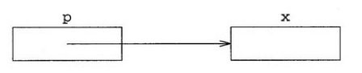
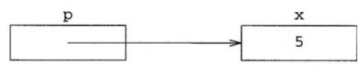

# 10. 메모리 관리 및 저수준 데이터 구조

라이브러리를 사용하는 법을 학습했다면 이에 어떻게 동작하는지 이해해 보자.

라이브러리 동작을 이해하는 핵심 사항은 프로그래밍 언어에 있는 기본 영역의 프로그래밍 도구와 기술을 포함하는 것이며 이러한 개념을 가르치려고 **저수준**이라는 용어를 사용한다.

왜냐면 표준 라이브러리 기반이며, 일반적은 컴퓨터 하드웨어가 동작하는 방식과 밀접하기 때문이다. 따라서 사용하기 어렵고 위험하지만 철저한 이해가 뒷받침 된다면 표준 라이브러리를 사용하는 것보다 효율적일 수 있다.

이 장에서는 배열과 포인터가 어떻게 동작하는지 이해한 후 11장에서 라이브러리가 배열과 포인터를 사용하여 어떻게 컨테이너를 구현하는지 살펴볼 것이다.


## 10.1 포인터와 배열

포인터와 배열은 C 및 C++에서 가장 원시적인 데이터 구조 중하나이다. 두 개념은 서로 분리할 수 없으므로 포인터를 사용하지 않고 배열을 유용하게 다룰 수 없으며, 또한 배열과 함께 사용할 때 훨씬 유용하다.


### 10.1.1 포인터

**포인터**는 객체의 **주소**를 나타내는 값이다. 모든 개별 객체는 주소가 있으며, 해당 주소는 컴퓨터 메모리에 객체가 저장된 부분을 가리킨다. 

객체에 접근할 수 있다면 객체의 주소를 얻을 수 있으며 그 반대도 마찬가지이다. 예를 들어 x가 객체일 따 &x는 객체의 주소고, p가 객체의 주소일 때 *p는 객체 자체이다.

&x에서 &는 **주소 연산자**라고 하며 참조 타입을 정의하는 &의 용도와 다르다.

*는 **역참조 연산자**라고 하며 반복자를 적용해 사용한 *와 비슷한 방식으로 동작한다. 만약 p가 x의 주소가 있다면 p는 x를 카리키는 포인터이다. 이 상태를 그림으로 나타내면 다음과 같다.



다른 기본 타입과 마찬가지로 포인터인 지역 변수는 우리가 값을 할당할 때까지 의미 없는 값을 갖는다. 따라서 초기화하지 않은 포인터는 어디를 가리키는지 알 수 없는 상태이며, 이를 사용하면 잘못된 메모리에 접근할 위험이 있다.

그래서 프로그래머는 포인터를 초기화할 때 흔히 `0`을 사용한다.

```cpp
int* p = 0;
```

여기서 `0`은 단순한 숫자 0이라기보다, “아무 객체도 가리키지 않는다”는 특별한 의미로 포인터에 변환된다. 이렇게 변환된 값은 실제 객체의 주소와 겹치지 않도록 보장되므로, 포인터가 현재 유효한 객체를 가리키고 있는지 안전하게 확인할 수 있다.

또한 C++에서는 정수값 가운데 오직 `0`만 특별히 포인터 타입으로 변환할 수 있다. 이러한 특별한 포인터 값을 null 포인터(null pointer)라고 한다.

요즘 C++에서는 의미를 더 명확하게 나타내기 위해 `0` 대신 `nullptr`을 사용하는 경우가 많다.

```cpp
int* p = nullptr;
```

이 역시 “아무 객체도 가리키지 않는 포인터”를 의미한다.


C++에 존재하는 모든 값과 마찬가지로 포인터는 타입이 있다. T 타입인 객체의 주소는 T포인터  타입이며 T*라고 표기한다.

x를 int 타입 객체로 가정하면 다음처럼 정의할 수 있다.

```c++
int x;
```

그리고 p를 x주소가 있는 타입으로 정의하도록 하자, 즉 p의 타입은 'int 포인터'이며, 이것은 int타입의 *p를 정의하여 간접적으로 나타낼 수 있다.

```c++
int *p; // *p는 int 타입
```

*p는 단일 변수를 정의하는 정의문을 구성하는 **선언자**이며, 해당 선언자는 *와 p로 구성된다. 하지만 대부분 프로그래머는 p에 있는 타입(int *)를 강조하려고 다음처럼 작성한다.

```c++
int* p;
```


지금까지 살펴본 내용을 바탕으로 다음처럼 포인터를 사용하는 간단한 프로그램을 작성해 보자

```c++
int main()
{
    int x = 5;

    // p는 x를 가리킴
	int* p = &x;
	cout << "x = " << x << endl;

	// p를 통해 x의 값을 변경
	*p = 6;
	cout << "x = " << x << endl;

	return 0;
}
```

출력 결과는 다음과 같다

```
x = 5
x = 6
```


p를 정의한 직후 변수들의 상태는 다음과 같다.




첫번째 출력문을 실행했을 때 x가 5이다. 그 다음 실행문에서는 *p = 6을 이용해 x 값을 6으로 바꾼다.

기억해야할 것은 p에 x의 주소가 있으므로 *p와 x를 사용해 같은 객체 하나를 참조할 수 있다.

따라서 두 번째 출력문을 실행했을 때 값은 6이다.


### 10.1.2 함수 포인터

6.2.2에서는 함수 하나를 다른 함수의 인자로 전달하는 프로그램을 살펴보았다. 그런데 실제로는 눈에 보이는 것보다 조금 더 복잡한 일이 일어나고 있다.

사실 함수는 일반 객체(object)가 아니다.  따라서 변수처럼 복사(copy)하거나 대입(assign)할 수 없고, 함수 자체를 직접 인자로 전달할 수도 없다

그럼에도 6.2.2에서 

```c++
write_analysis(median_analysis);
```

처럼 함수 이름을 인자로 넘기는 코드를 보면 마치 함수를 그대로 전달하는 것처럼 보이지만, 실제로는 그렇지 않다.

함수는 프로그램이 새로 만들거나 수정할 수 있는 대상이 아니다. 함수의 생성과 관리에는 컴파일러가 관여한다.
프로그램이 함수에 대해 할 수 있는 일은 다음 두 가지뿐이다.

- 함수를 호출(call)하기
- 함수의 주소(address)를 얻기

그렇다면 어떻게 함수를 다른 함수의 인자로 넘길 수 있을까?

컴파일러가 이런 코드를 조용히 변환하기 때문이다.

즉:

```c++
write_analysis(median_analysis);
```

를 내부적으로는:

```
“median_analysis 함수 자체”
```

가 아니라

```
“median_analysis 함수의 주소”
```

로 전달하는 형태로 바꾼다. 즉 함수 포인터를 전달하는 것이다.


함수 포인터 선언자는 다른 선언자와 비슷하다. 예를 들어 *p가 int 타입이란걸 나타내려면 이렇게 작성한다.

```c++
int* p;
```

이는 p가 포인터임을 의미한다. 따라서 fp를 역참조하여 int 타입의 인수를 호출하여 int 타입의 결과를 반환할 때는 다음처럼 작성할 수 있다.

```c++
int (*fp)(int);
```

이는 fp가 int 타입의 인수로 int 타입의 결과를 반환하는 함수 포인터임을 의미한다.


우리가 할 수 있는 것은 함수 주소를 얻거나 함수를 호출하는 것뿐이므로 호출을 제외한 함수 사용에서 &를 명시하지 않더라도 해당 함수의 주소를 얻는 것으로 간주한다. 마찬가지로 포인터를 명시적으로 역참조하지 않더라도 함수 포인터를 호출할 수 있다. 다음처럼 fp 타입이 일치하는 함수를 가정해 보자

```c++
int next(int n)
{
	return n + 1;
}
```


그리고 다음 두 실행문 가운데 하나를 사용하면 fp가 next를 가리키게 만들 수 있다.

```c++
fp = next; // fp는 next 함수를 가리킴
fp = &next; // fp는 next 함수를 가리킴
```


마찬가지로 i가 int 타입 변수일 때 다음 두 실행문 중 하나를 사용하면 fp로 next를 호출하여 i를 증가시킬 수 있다.

```c++
i = fp(i);
i = (*fp)(i); 
```


마지막으로, 함수가 다른 함수를 매개변수로 받는 것처럼 보이는 경우에도 실제로는 함수 자체가 전달되는 것이 아니라 함수 포인터가 전달된다. 컴파일러가 이를 자동으로 함수 포인터 형태로 변환해 주기 때문이다.

예를 들어 6.2.2의 `write_analysis` 함수에서 다음과 같이 작성한 매개변수는

```c++
double analysis(const vector<Student_info>&)
```

실제로는 다음과 같은 의미이다.

```c++
double (*analysis)(const vector<Student_info>&)
```

즉 `analysis`는 함수 자체가 아니라, `const vector<Student_info>&`를 인자로 받아 `double`을 반환하는 함수의 주소를 저장하는 함수 포인터이다.

다만 이러한 자동 변환은 함수의 매개변수에서만 적용된다. 함수를 반환값으로 사용할 때는 컴파일러가 자동으로 함수 포인터로 바꿔주지 않기 때문에, 함수 포인터 타입을 직접 명시해야 한다.

예를 들어 다음과 같이 typedef를 사용하면

```c++
typedef double (*analysis_fp)(const vector<Student_info>&);
```

`analysis_fp`라는 이름을 “`const vector<Student_info>&`를 받아 `double`을 반환하는 함수의 포인터 타입”으로 사용할 수 있다.

이제 이를 이용해 함수 포인터를 반환하는 함수를 다음처럼 간단하게 선언할 수 있다.

```c++
analysis_fp get_analysis_ptr();
```

이 선언은 “`get_analysis_ptr` 함수는 analysis 함수 타입의 포인터를 반환한다”는 뜻이다.

반대로 typedef를 사용하지 않으면 다음과 같이 작성해야 한다.

```c++
double (*get_analysis_ptr())(const vector<Student_info>&);
```

문법이 매우 복잡하고 읽기 어렵기 때문에, 실제로는 typedef나 using을 사용해 함수 포인터 타입에 별칭을 붙여 사용하는 경우가 많다.


함수 포인터를 가장 흔히 사용하는 예는 다른 함수의 인수로 사용할 때이다. 예를 들어 라이브러리 함수인 find_if의 구현을 살펴보자

```c++
template<class In, class Pred>
In find_if(In begin, In end, Pred f)
{
    while (begin != end && !f(*begin))
        ++begin;

    return begin;
}
```

여기서 `Pred`는 특별한 타입이 아니라, `f(*begin)`처럼 호출할 수 있기만 하면 어떤 타입이든 사용할 수 있다.

예를 들어 다음과 같은 조건 함수(predicate function)가 있다고 하자.

```
bool is_negative(int n)
{
    return n < 0;
}
```

이 함수는 숫자가 음수이면 `true`, 아니면 `false`를 반환한다.

이제 `vector<int>`인 `v`에서 첫 번째 음수를 찾기 위해 다음과 같이 사용할 수 있다.

```
vector<int>::iterator i =
    find_if(v.begin(), v.end(), is_negative);
```

여기서 `is_negative` 뒤에 `()`를 붙이지 않은 이유는 함수를 실행하려는 것이 아니라, 함수 자체를 전달하려는 것이기 때문이다. 실제로는 함수의 이름이 자동으로 함수 포인터로 변환되어 전달된다.

마찬가지로 `find_if` 내부에서 사용한

```
f(*begin)
```

도 사실은 함수 포인터를 통해 함수를 호출하는 코드이다. 원래는 `(*f)(*begin)`처럼 작성할 수도 있지만, C++이 자동으로 처리해 주기 때문에 더 간단하게 쓸 수 있다


## 10.1.3 배열

**배열(array)**은 표준 라이브러리에 포함된 컨테이너가 아니라, C++ 언어 자체에 포함된 기본 기능이다. 배열에는 같은 타입의 객체들이 순서대로 저장된다. 또한 배열의 크기(원소 개수)는 반드시 컴파일 시점에 결정되어 있어야 한다. 따라서 vector 같은 라이브러리 컨테이너와 달리, 배열은 실행 중에 크기를 늘리거나 줄일 수 없다.

배열은 클래스 타입이 아니기 때문에 멤버 함수나 멤버 타입이 없다. 예를 들어 vector에는 크기를 나타낼 때 사용하는 `size_type`이 있지만, 배열에는 그런 것이 없다. 대신 `<cstddef>` 헤더에서 제공하는 `size_t` 타입을 사용한다. `size_t`는 객체의 크기나 배열의 크기를 저장하기에 충분한 크기의 부호 없는 정수(unsigned integer) 타입이다.

예를 들어 3차원 공간의 좌표를 저장하려면 다음처럼 배열을 사용할 수 있다.

```c++
double coords[3];
```

이 코드는 `double` 값 3개를 저장하는 배열을 만든다. 보통 x, y, z 좌표를 저장하는 용도로 생각할 수 있다.

하지만 숙련된 프로그래머는 보통 숫자 `3`을 직접 쓰기보다 다음처럼 작성한다.

```c++
const size_t NDim = 3;
double coords[NDim];
```

이렇게 하면 코드의 의미가 더 분명해진다. 여기서 `NDim`은 “차원의 개수(number of dimensions)”를 의미한다. 즉 단순한 숫자 3이 아니라 “이 배열은 3차원 좌표를 저장한다”는 의미를 코드에 담을 수 있다.

또한 `NDim`은 `const size_t` 상수이므로 컴파일 시점에 값이 이미 결정되어 있다. 배열 크기는 컴파일 시점에 알아야 하기 때문에 이런 방식으로 사용할 수 있다.

배열과 포인터 사이에는 매우 중요한 관계가 있다. 배열 이름을 값처럼 사용하면, 실제로는 배열의 첫 번째 원소를 가리키는 포인터로 변환된다.

예를 들어:

```
double coords[3];
```

에서 `coords`는 배열 이름이지만, 값처럼 사용하면:

```
coords == &coords[0]
```

와 비슷하게 동작한다. 즉 배열의 첫 번째 원소 주소를 의미한다.

따라서 포인터처럼 `*` 연산자를 사용할 수 있다.

```
*coords = 1.5;
```

이 코드는 배열의 첫 번째 원소에 1.5를 저장한다. 즉 실제 의미는 다음과 같다.

```
coords[0] = 1.5;
```


### 10.1.4 포인터 연산

이제 우리는 배열을 정의하는 방법과 배열의 첫 번째 원소 주소를 얻는 방법을 알고 있다. 또한 배열 이름을 값처럼 사용하면 첫 번째 원소를 가리키는 포인터로 변환된다는 것도 보았다. 더 구체적으로 말하면, 포인터는 배열의 원소를 가리키는 경우 “포인터 연산(pointer arithmetic)”을 사용할 수 있다.

배열과 포인터에는 중요한 관계가 있다. 만약 포인터 `p`가 배열의 m번째 원소를 가리키고 있다면:

```c++
p + n
```

은 배열의 `(m + n)`번째 원소를 가리킨다.

반대로:

```c++
p - n
```

은 `(m - n)`번째 원소를 가리킨다.

물론 그런 원소가 실제로 존재해야 한다. 예를 들어 이전에 정의한 배열:

```c++
double coords[3];
```

배열 이름 `coords`는 첫 번째 원소 주소를 의미하므로:

```txt
coords == &coords[0]
```

이며,

```cpp
coords + 1
```

은 두 번째 원소 주소를 의미한다.

```cpp
coords + 2
```

는 세 번째 원소 주소를 의미한다.

이 배열은 원소가 3개뿐이므로 이것이 마지막 원소이다.

그렇다면:

```cpp
coords + 3
```

은 무엇일까?

이 값은 “존재하지 않는 네 번째 원소가 있었을 위치”를 나타낸다. 즉 실제 원소를 가리키지는 않는다.

그런데 흥미롭게도 `coords + 3`은 유효한 포인터이다. 비록 실제 원소를 가리키지는 않지만, 배열의 끝 바로 다음 위치를 나타내는 특별한 값으로 사용할 수 있다.

C++에서는 배열이나 컨테이너의 “끝 다음 위치(one past the end)”를 나타내는 포인터나 iterator를 자주 사용한다.

예를 들어 배열 내용을 vector에 복사할 수 있다.

```c++
vector<double> v;

copy(coords, coords + NDim, back_inserter(v));
```

여기서 `NDim`은 3이다.

즉:

```cpp
copy(coords, coords + 3, ...)
```

와 같다.

이 코드는:

```txt
coords부터 시작해서
coords + 3 직전까지
```

원소를 복사하라는 뜻이다.

중요한 점은 `coords + 3`이 실제 원소는 아니지만, “끝 위치”를 나타내는 용도로는 완전히 정상이라는 것이다.

마찬가지로 vector는 두 iterator를 이용해 생성할 수 있으므로 다음처럼도 작성할 수 있다.

```cpp
vector<double> v(coords, coords + NDim);
```

즉 배열 전체 내용을 vector로 복사해서 초기화하는 코드이다.

배열을 표준 라이브러리 알고리즘과 함께 사용할 때는 배열 이름과 끝 위치를 넘겨주면 된다. 예를 들어 vector에서는:

```cpp
v.begin(), v.end()
```

를 사용하지만 배열에서는:

```cpp
a, a + n
```

형태를 사용한다.

즉:

```txt
배열 시작 주소
배열 끝 다음 주소
```

를 전달하는 것이다.

또한 두 포인터를 빼는 것도 가능하다.

만약 `p`와 `q`가 같은 배열의 원소를 가리키는 포인터라면:

```cpp
p - q
```

는 두 원소 사이의 거리(원소 개수 차이)를 의미한다.

예를 들어:

```cpp
coords + 2 - coords
```

는 결과가 2이다.

즉 첫 번째 원소에서 세 번째 원소까지 두 칸 떨어져 있다는 뜻이다.

마지막으로, 배열의 시작 이전 위치를 가리키는 포인터는 만들 수 없으며 사용해서도 안 된다.

배열 `a`가 원소 n개를 가진다면:

```cpp
a + i
```

는 다음 조건에서만 유효하다.

```txt
0 <= i <= n
```

즉 마지막 원소 다음 위치(`i == n`)까지는 허용되지만, 그보다 더 뒤나 배열 시작 이전은 허용되지 않는다.
