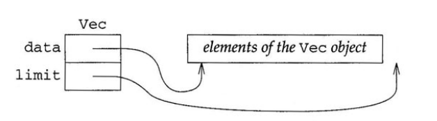
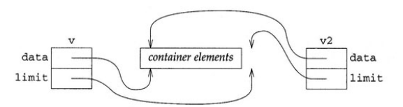
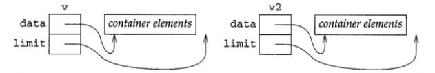
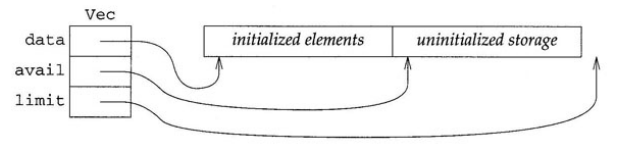
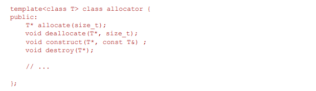

# 11. 추상 데이터 타입

9장에서 정의한 Student_info 클래스 타입을 설명하면서 Student_info 타입의 객체를 복사, 할당, 소멸하는 과정을 구체적으로 설명하지 않았다.

이 장에서 살펴볼 것은 클래스를 작성하는 프로그래머가 객체의 모든 동작을 제어하는 방법이다.

지금까지 벡터를 폭넓게 사용했으므로 클래스를 설계하고 구현하는 방법의 이해를 높이기 위해 벡터와 비슷한 클래스를 작성할 것이다.

여기서 제시하는 구현 방법은 벡터의 동작 실행과 효율적인 사용성 측면에서 크게 단순화될 것이다. 또한 표준 라이브러리 벡터 클래스의 핵심 부분을 경량화해 구현한 버전이므로 라이브러리 클래스와 혼동하지 않게 Vec이라고 클래스 이름을 붙인다.

vec 클래스의 객체를 복사, 할당, 소멸하는 방법을 살펴보기 전에 몇 가지 간단한 멤버 함수를 구현한 후, 클래스의 객체를 복사, 할당, 소멸하는 방법을 다시 살펴볼 것이다.


## 11.1 Vec 클래스

클래스를 설계할 때는 보통 제공하는 동작이 무엇인지 명시하는 것으로 시작한다.

올바른 동작을 결정하는 한 가지 방법은 클래스를 사용하는 프로그래머가 작성할 수 있는 프로그램의 종류를 살펴보는 것이다.

여기서는 표준 벡터 클래스의 하위 버전을 구현할 것이므로 벡터를 사용하는 방법부터 살펴보자

```c++
vector<Student_info> vs; // 빈 벡터
vector<double> v(100); // 100개의 요소를 가진 벡터

// 벡터가 사용하는 타입의 이름을 얻음
vector<Student_info>::const_iterator b, e;
vector<Student_info>::size_type i = 0;

// size 함수와 인덱스 연산자를 사용하여 벡터의 각 요소를 탐색
for (i = 0; i < vs.size(); ++i)
	cout << vs[i].name() << endl;

b = vs.begin();
e = vs.end();
```

물론 이 동작들은 벡터 클래스가 제공하는 동작에 포함되어 있다. 하지만 이러한 동작들을 직접 구현해보면 벡터 동작의 상당 부분을 지원하는데 필요한 프로그래밍 언어의 기능을 이해할 수 있다.


## 11.2 Vec 클래스 구현하기

구현할 동작들을 결정한 후에는 Vec 클래스를 어떻게 나타낼지 생각해야 한다.

**템플릿 클래스**를 정의하는 것이 가장 쉬운 구현 방법이다. 프로그래머들이 Vec클래스를 사용하여 여러 종류ㅡ이 타입을 다룰수 있게 구현하자.

8.1.1에서 살펴본 함수 템플릿의 기능은 클래스에도 적용된다. 8.1.1에는 템플릿 함수를 사용하여 다양한 타입으로 동작할 수 있는 함수 버전들을 만들 수 있었다. 이와 마찬가지로 템플릿 클래스를 사용하면 템ㅁ플릿 매개변수 목록의 타입만 다른 여러 클래스 버전을 만들 수 있었다.

템플릿 클래스를 정의할 때는 템플릿 함수와 마찬가지로 클래스가 템플릿임을 명시하고 클래스에 사용할 매개변수를 나열해야 한다.

```c++
template <class T> class vec{
public:
	// 인터페이스
private:
	// 구현
}
```

앞 코드는 Vec에 T 타입의 타입 매개변수가 있는 템플릿 클래스임을 나타낸다. 다른 클래스 타입과 마찬가지로 인터페이스와 구현을 각각 정의하는 public과 private 부분이 있다.

다음으로 어떤 데이터를 저장할 것인지 생각해야 한다. 즉, Vec에 있는 요소들을 저장할 공간이 필요할 것이고 Vec에 있는 요소 개수를 알아야 한다. 가장 확실한 방법은 동적으로 할당된 배열에 Vec의 요소들을 저장하는 것이다.

그렇다면 해당 배열에 필요한 정보는 begin 함수, end함수, size 함수를 구현할 예정이다. 이는 배열의 첫 번째 요소를 가리키는 주소, 마지막 요소의 다음을 가리키는 주소, 배열에 있는 요소 개수를 저장할 수 있다는 의미이다.

하지만 이러한 세 항목을 모두 저장할 필요는 없다. begin과 end 함수를 이용해 배열 크기를 계산하는 size 함수를 간단하게 구현할 수 있다. 배열의 첫 번째 요소를 가리키는 포인터와 마지막 요소의 다음을 가리키는 포인터만 저장하고 이 둘을 사용하여 필요에 따라 배열 크기를 계산할 것이다. 이러한 데이터 구조는 다음과 같은 그림으로 나타낼 수 있다.

 

지금까지 살펴본 내용을 바탕으로 새롭게 구성해본 Vec 클래스는 다음과 같다.

```c++
template <class T> 
class vec {
public:
	// 인터페이스
private:
	T* data; // Vec의 첫 번쨰 요소를 가리키는 포인터
	T* limit; // Vec의 마지막 요소 다음을 가리키는 포인터
};
```

앞 클래스 정의문은 Vec가 템플릿 타입이며 하나의 타입 매개변수가 있다는 것을 나타낸다.

클래스 정의의 본문에서 타입 매개변수 T를 사용할 때마다 컴파일러는 Vec를 만드는 프로그래머가 지정한 타입으로 T를 대체할 것이다. 다음 예를 살펴보자

```c++
vec<int> v;
```

앞 정의문으로 컴파일러가 인스턴스화 하는 Vec클래스는 T의 각 참조를 int로 대체하게 된다.

이러한 클래스에 관해 컴파일러가 만드는 코드는 T를 포함한 표현식을 마치 int를 사용하여 작성한 것처럼 처리할 것이다.

즉 data와 limit의 선언문의 타임 매개변수 T를 사용했으므로 해당 포인터의 타입을 Vec에 있는 객체 타입에 따라 달라진다.

Vec에 있는 객체 타입은 Vec의 정의문이 인스턴스화 되기 전까지는 알 수 없다. 즉 Vec<int>를 이용해 data와 limit의 타입을 알 수 있다. 이들의 타입은 Vec의 인스턴스를 가리키는 int*가 될 것이다. 이와 마찬가지로 Vec<string>를 이용할 때 컴파일러는 문자열에 T를 바인딩하는 Vec의 새로운 인스턴스를 만든다. 이 때 data와 limit의 타입은 string*가 된다.


### 11.2.1 메모리 할당

우리가 만들 `Vec` 클래스는 배열을 동적으로 할당할 것이므로, 할당할 요소의 개수를 `n`이라고 할 때 `new T[n]`을 사용하여 `Vec`을 위한 공간을 할당할 것이라 예상할 수 있다.

하지만 `new T[n]`은 단순히 메모리 공간만 할당하는 것이 아니라, 타입 `T`의 기본 생성자(Default Constructor)를 실행하여 각 요소들을 초기화한다는 점을 기억해야 한다. 만약 우리가 `new T[n]`을 사용하게 된다면, 타입 `T`에 한 가지 제약 조건을 강제하게 된다. 즉, 사용자가 `Vec<T>`를 생성할 때 `T`에 반드시 기본 생성자가 있어야만 한다는 제약이다.

그러나 표준 라이브러리의 `vector` 클래스는 이러한 제약 조건을 강제하지 않는다. 우리는 표준 `vector`를 똑같이 흉내 내어 구현하기를 원하므로, 우리 역시 사용자에게 이러한 제약을 주지 않으려 한다.

결국 표준 라이브러리는 메모리 할당을 더 세밀하게 제어할 수 있는 메모리 할당 클래스를 제공한다. 우리가 `new`와 `delete` 대신 이 클래스를 사용한다면 우리의 요구사항에 정확히 부합할 것이다. 이 클래스는 우리에게 생 메모리(Raw memory)를 할당할 수 있게 해주며, 그 후 별도의 단계에서 해당 메모리에 객체를 구축 할 수 있도록 지원한다.

이 클래스의 세부 사항으로 바로 들어가기보다는, 우선 우리 대신 메모리를 관리할 유틸리티 함수들을 결국 작성해야 할 것이라고 가정한다. 지금은 이 함수들이 존재한다고 가정하고, `Vec` 클래스를 완성하는 데 이들을 사용할 것이다. 이 함수들을 사용해 나가면서 함수들이 정확히 어떤 기능을 수행해야 하는지 더 명확하게 파악할 수 있으며, 결과적으로 실제 구현 시점에 우리가 무엇을 구현해야 하는지 정확히 알게 된다.

이 새로운 유틸리티 멤버들은 클래스의 `private` 구현부에 속하게 된다. 이들은 필요한 메모리를 할당 및 해제하고, `Vec`에 저장된 요소들을 초기화하고 소멸시키는 책임을 진다.

따라서 이 함수들은 우리의 포인터인 `data`와 `limit`을 관리한다. 오직 이 메모리 관리 함수들만이 이 데이터 멤버들에 새로운 값을 부여할 수 있다. `Vec`의 `public` 멤버들은 `data`와 `limit`을 읽을 수는 있지만 변경하지는 못한다.

`public` 멤버가 새로운 `Vec`을 생성하는 등 `data`나 `limit`의 값을 변경해야 하는 작업을 수행할 때는, 직접 값을 바꾸는 대신 적절한 메모리 관리 함수를 호출하여 처리한다. 이러한 전략을 통해 작업을 분할할 수 있다. 즉, 한 세트의 멤버들은 사용자에게 인터페이스를 제공하고, 다른 세트의 멤버들은 구체적인 구현 세부사항을 처리하게 된다.

이 유틸리티 함수들의 구체적인 세부 구현은 §11.5에서 다시 돌아와 채워 넣을 것이다.


## 11.2.2 생성자

다음과 같은 2개의 생성자를 정의해야 한다.

```c++
vector<Student_info> vs; // 빈 벡터
vector<double> v(100); // 100개의 요소를 가진 벡터
```

이와 더불어 표준 벡터는 세 번째 생성자도 제공한다. 세 번째 생성자는 벡터 요소를 초기화하는데 사용하는 크기와 초깃값을 전달받고, 전달 받은 값의 복사본으로 모든 요소를 초기화 한다. 이 생성자는 크기만 전달 받은 생성자와 비슷하므로 문제없이 구현할 수 있다.

모든 생성자는 객체의 올바른 초기화를 보장하는 역할이다 Vec 객체라면 data와 limit을 초기화 해야 한다.

이러한 동작은 Vec의 요소들을 저장할 공간을 할당하는 것과 해당 요소를 알맞은 값으로 초기화 하는 것을 포함한다.

기본 생성자라면 빈 Vec를 만드는 것이므로 메모리 공간을 할당할 필요가 없다. 벡터 크기를 전달받은 생성자라면 주어진 양만큼의 저장 공간을 할당한다. 벡터 크기와 초기값을 함께 전달받은 생성자라면 전달받은 초깃값을 사용하여 할당된 모든 요소를 초기화 한다.

Vec 클래스를 사용하는 프로그래머가 벡터 크기만 전달하면 T 타입의 기본 생성자를 사용해 요소를 초기화 할 때 사용할 값을 얻는다. 당장은 data와 limit을 초기화 하는 동작과 요소 할당 및 초기화에 관련된 동작들은 아직 작성하지 않은 메모리 관리 함수에게 넘길 것이다.

```c++
template <class T> 
class vec {
public:
	vec() {create(n)}
	explicit Vec(std::size_t n, const T& val = T()) { create(n, val); }
	// 인터페이스
private:
	T* data; // Vec의 첫 번쨰 요소를 가리키는 포인터
	T* limit; // Vec의 마지막 요소 다음을 가리키는 포인터
};
```

인수가 없는 기본 생성자는 Vec가 비어있음을 나타내야 한다. 이 때문에 나중에 작성할 멤버 함수인 create를 호출한다. create 함수를 실행햐만 data와 limit의 값을 모두 0으로 설정하려고 한다.

두 번째 생성자는 새로운 키워드인 explicit를 사용한다. 우선 두 번째 생성자의 동작을 살펴보자.

2번째 매개변수는 기본 인수를 사용한다. 따라서 이 생성자는 생성자 2개를 정의하는 셈이다.

즉 아래 코드 처럼 두개를 정의하는 셈

```c++
Vec<int> vi1(5);     // 정상 (인자 1개) -> 크기 5, 기본값 0으로 채움
Vec<int> vi2(5, 99); // 정상 (인자 2개) -> 크기 5, 99로 채움
```

하나는 size_t타입의 단일 인수를 전달받고, 다른 하나는 size_t 타입과 const T& 타입의 인수를 전달받는다. 두 생성자 모두 벡터의 크기와 값을 모두 전달 받은 버전의 create함수를 호출한다.

create 함수는 T 타입 객체 n개를 저장할 수 있는 크기의 메모리를 할당하고 요소들의 초기값을 val로 설정한다. create 함수를 사용하는 프로그래머는 해당 값을 명시적으로 제공해야 하며, 그렇지 않을 때는 T의 기본 생성자가 "값 초기화" 규칙을 사용하여 초기값을 만든다.

이제 explicit를 짧게 살펴보자. 이 키워드는 단일 인수가 있는 생성자의 정의에서만 의미가 있다. 생성자가 explicit라면 컴파일러는 프로그래머가 명시적으로 생성자를 호출하는 상황에서만 해당 생성자를 사용한다.

```c++
Vec<int> vi(100); // 정상 : 명시적으로 Vec을 생성
Vec<int> vi = 100; // 오류 : 암묵적으로 vi를 생성
```

explicit는 생성자를 사용하는 다른 상황에서 중요할 수 있으므로 12.2에서 더 살펴볼 것이다.


### 11.2.3 타입 정의

표준 템플릿 클래스들이 따르는 관례에 맞춰, 우리도 사용자가 활용할 수 있는 타입 이름(별칭)을 제공하는 동시에 클래스의 구체적인 구현 세부사항은 숨기고자 한다. 구체적으로는 `const`인 반복자와 `const`가 아닌 반복자 타입에 대한 `typedef`, 그리고 `Vec`의 크기를 나타낼 때 사용할 타입에 대한 `typedef`를 제공해야 한다.

또한 표준 라이브러리 컨테이너들은 `value_type`이라는 또 다른 타입도 정의한다. 이 타입은 컨테이너가 저장하는 객체 타입의 동의어(별칭)이다. 앞으로 `Vec` 클래스에 `push_back` 함수를 추가하여 사용자가 `Vec` 객체의 크기를 동적으로 키울 수 있도록 할 예정이다. 이때 `value_type`을 함께 정의해 두면, 사용자는 `back_inserter`(`push_back`과 `value_type` 모두에 의존하는 기능)를 활용해 `Vec`의 크기를 늘려주는 출력 반복자를 생성할 수 있게 된다.

이러한 타입들을 정의할 때 유일하게 까다로운 부분은 '어떤 타입으로 결정할 것인가'이다. 이미 살펴보았듯이, 반복자는 컨테이너 내부의 객체들 사이를 이동하며 그 값을 검사할 수 있도록 돕는 객체다. 반복자 자체가 클래스 타입으로 구현되는 경우도 흔하다.

예를 들어, 연결 리스트(Linked List)를 구현하는 클래스를 생각해 보자. 이러한 클래스는 각 노드가 값과 다음 노드를 가리키는 포인터를 포함하는 '노드의 집합'으로 리스트를 모델링하는 것이 논리적이다. 이 경우 리스트의 반복자는 노드 중 하나를 가리키는 포인터를 내부에 포함해야 하며, 리스트의 다음 노드로 포인터를 이동시키기 위해 `++` 연산자를 직접 구현해야 한다. 따라서 이러한 반복자는 반드시 클래스 타입으로 구현해야만 한다.

그러나 우리는 `Vec`의 요소들을 저장하기 위해 일반 '배열'을 사용하므로, 단순한 '날것의 포인터(Plain pointer)'를 `Vec`의 반복자 타입으로 그대로 사용할 수 있다. 각각의 포인터는 내부의 `data` 배열을 가리키게 된다. 앞서 §10.1에서 배웠듯이, 포인터는 임의 접근 반복자(Random-access iterator)가 가져야 하는 모든 연산을 기본적으로 지원한다. 포인터를 내부 반복자 타입으로 사용함으로써, 우리는 표준 `vector` 클래스와 일치하는 완전한 임의 접근 성능을 제공할 수 있다.

그렇다면 다른 타입들은 어떻게 결정해야 할까? `value_type`이 가리킬 타입은 명확하다. 바로 템플릿 매개변수인 `T`이다. 그렇다면 크기를 나타내는 타입은 무엇으로 해야 할까? 우리는 `size_t`가 그 어떤 배열의 요소 개수도 충분히 담을 수 있을 만큼 큰 타입이라는 것을 알고 있다. 우리는 `Vec`의 요소들을 배열에 저장하고 있으므로, `size_t`를 `Vec::size_type`을 구성하는 내부 타입으로 사용할 수 있다.

이러한 결정들을 반영하면, 이제 우리의 클래스는 다음과 같은 모습을 갖추게 된다.

```c++
template <class T> 
class vec {
public:
	typedef T* iterator;
	typedef const T* const_iterator;
	typedef std::size_t size_type;
	typedef T value_type;
	typedef std::ptrdiff_t difference_type;
	typedef T& reference;
	typedef const T& const_reference;

	vec() {create(n)}
	explicit Vec(std::size_t n, const T& val = T()) { create(n, val); }
	// 인터페이스
private:
	T* data; // Vec의 첫 번쨰 요소를 가리키는 포인터
	T* limit; // Vec의 마지막 요소 다음을 가리키는 포인터
};
```

여기서 알맞은 typedef를 추가하는 것 외에도 새로운 타입을 사용하도록 클래스를 바궜다. typedef 선언문을 사용한 클래스 내부에서 같은 이름의 타입을 사용하여 코드의 가독성을 높이고, 나중에 이러한 타입 중 하나의 기저 타입을 바꿨을 때 동기화 되지 않은 상황을 예방할 수 있다.


### 11.2.4 인덱스와 size 함수

우리는 Vec 클래스를 사용하는 프로그래머가 size 함수를 호출하여 Vec에 속한 요소 개수를 얻도록 만들어야 한다.

또한 인덱스 연산자를 사용하여 Vec에 속한 요소에 접근할 수 있도록 만들어야 한다. 다음 코드를 예를 들어 보자

```c++
for (i = 0; i != vs.size(); ++i)
    cout << vs[i].name();
```

앞 코드는 size 함수가 Vec 클래스의 멤버여야 하고 Vec 상에서 인덱스 연산자인 []를 정의할 필요가 있다.

 size 함수의 구현은 어렵지 않다. size 함수는 인수가 없으며 Vec에 속한 요소 개수를 Vec::size 타입으로 반환해야 한다.

인덱스 연산을 정의하기 앞서 오버로드 연산자의 동작을 더 알아보자.

오버로드된 연산자를 정의하는 것은 여느 함수를 정의하는 것과  비슷하며 이름, 인수, 반환 타입을 지정한다.

오버로드된 연산자 이름은 operator 키워드와 연산자 기호를 붙여 구성한다. 즉 operator[]가 이름이 된다.

해당 함수의 매개변수의 개수는 연산자 종류에 따라 달라진다. 연산자를 멤버가 아닌 함수로 정의할 때는 연산자에 있는 피연산자의 개수만큼 인수가 있다.

따라서 첫 번째 인수는 왼쪽 피 연산자에 바인딩되고 두번째 인수는 오른쪽 피 연산자에 바운딩 된다.

연산자를 멤버함수로 정의할 때는 연산자를 호출한 객체가 왼쪽 피연산자로 암묵적으로 바인딩된다. 따라서 연산자 함수는 실제로 연산자에 필요한 것보다 하나 적은 인수가 있다.

일반적으로 연산자 함수는 멤버일 수도 아닐 수도 있지만, 인덱스 연산자는 반드시 멤버여야 한다. 프로그래머가 vs[i]와 같은 표현식을 작성했다면 해당 표현식은 i를 인수로 전달하여 oeprator[] 멤버 함수를 호출한다.

이때 피연산자 i는 가능한 최대 크기의 Vec의 마지막  요소까지 나타낼 수 있을 만큼 충분히 큰 정수 타입이다. 또한 해당 타입은 vec::size_type이다. 남은 것은 인덱스 연산자가 반환하는 타입을 결정하는 일이다.

이제 우리는 인덱스 연산자가 Vec에 저장된 요소의 참조를 반환해야 한다는 것을 생각할 수 있다. 즉 프로그래머가 인덱스로 요소를 쓰고 읽을 수 있다. 

지금까지 내용으로 수정된 클래스는 다음과 같다.

```c++
template <class T> 
class vec {
public:
	typedef T* iterator;
	typedef const T* const_iterator;
	typedef std::size_t size_type;
	typedef T value_type;
	typedef std::ptrdiff_t difference_type;
	typedef T& reference;
	typedef const T& const_reference;

	vec() {create(n)}
	explicit Vec(std::size_t n, const T& val = T()) { create(n, val); }
	
	// 새로운 함수
	size_type size() const { return limit - data; }
	T& operator[](size_type i) { return data[i]; }
	const T& operator[](size_type i) const { return data[i]; }

private:
	T* data; // Vec의 첫 번쨰 요소를 가리키는 포인터
	T* limit; // Vec의 마지막 요소 다음을 가리키는 포인터
};
```

size 함수는 값을 저장하는 배열 범위를 결정하려고 두 포인터를 뺀 결과를 구한다.그리고 Vec에 있는 요소의 수를 계산한다.

10.1.4에서 살펴 보았듯이 두 포인터를 빼면 해당 포인터들이 참조하는 범위에 알맞은 요소 개수를 ptrdiff_t값으로 반환한다.

이 값은 size 함수의 반환 타입이자 size_t의 동의어는 size_type으로 변환된다.

Vec의 크기를 얻는 동작은 Vec을 바꾸지 않으므로 const 멤버 함수로 선언한다.

이렇게 하면 const Vec의 크기를 구할 수 있다.


인덱스 연산자는 배열에서 해당 위치를 찾아 요소의 참조를 반환한다. 참조를 반환하므로 vec에 저장된 값을 바꿀 수 있다. 이처럼 요소에 쓰기 동작이 가능하면 두 가지 버전의 인덱스 연산자가 필요하다.

하나는 const Vec 타입 객체를 다루고 하나는 Vec 타입의 객체를 다룬다.

const 버전은 const의 참조를 반환하므로 프로그래머는 읽기만 할 수 있고 쓸 수 없다.

값을 반환하지 않고 참조로 반환하는 것은 표준 벡터의 일관성을 유지하는데 필요하다. 참조를 반환하는 이유는 만약 컨테이너에 저장도니 객체가 점유하는 메모리 공간이 클 때 객체를 복사하지 않는 것이 효율적이기 때문이다.

두 가지 버전의 인덱스 연산자의 인수 목록은 같다. 하지만 인덱스 연산자는 size_type의 매개변수가 하나씩 있는 것처럼 보이지만 인덱스 연산자를 포함한 모든 멤버 함수는 대상이 되는 객체를 암묵적인 매개변수로 갖는다.

따라서 해당 객체가 const인지에 따라 동작이 다르므로 오버로드할 수 있는 것이다.


### 11.2.5 반복자를 반환하는 함수

다음으로 반복자를 반환하는 함수이다.

각각 vec의 시작에 놓인 반복자와 마지막의 다음에 놓인 반복자를 반환하도록 만들어 보자

```c++
template <class T> 
class vec {
public:
	// 11.2.3에 다룬 typedef 정의문

	vec() {create(n)}
	explicit Vec(std::size_t n, const T& val = T()) { create(n, val); }
	
	// 새로운 함수
	size_type size() const { return limit - data; }
	T& operator[](size_type i) { return data[i]; }
	const T& operator[](size_type i) const { return data[i]; }

	// 반복자를 반환하는 새로운 함수
	iterator begin() { return data; }
	const_iterator begin() const { return data; }

	iterator end() { return limit; }
	const_iterator end() const { return limit; }

private:
	T* data; // Vec의 첫 번쨰 요소를 가리키는 포인터
	T* limit; // Vec의 마지막 요소 다음을 가리키는 포인터
};
```

begin 및 end 함수는 두가지 버전이 있으며 vec이 const인지 아닌지에 따라 오버로드 된다. const 버전은 const interator를 반환하므로 읽을 수만 있고 쓸 수는 없다.


## 11.3 복사 제어

함수에 객체를 값으로 전달하거나 객체를 값으로 전달할 때 객체는 암묵적으로 복사된다 예를 들면

```c++
vector<int> vi;
double d;
d = median(vi); // vi를 median 함수의 매개변수로 복사

string line;
vector<string> words = split(line); //  split 함수에서 반환하는 객체를 words로 복사
```

마찬가지로 다른 객체를 초기화 하려고 명시적으로 객체를 복사할 수 있다.

```c++
vector<Student_info> vs;
vector<Student_info> v2 = vs; // vs를 v2로 복사
```

명시적 복사와 암묵적 복사는 모두 **복사 생성자**라는 특수한 생성자가 제어한다. 복사 생성자는 다른 생성자와 마찬가지로 클래스와 같은 이름을 갖는 멤버 함수이다.

새로운 객체를 이미 존재하는 같은 타입 객체의 복사본으로 초기화하는 것이므로 복사 생성자는 클래스 타입 인수 1개가 있다.

1. 복사 생성자는 함수의 인수를 복사하는 것을 포함한 복사본 생성의 의미를 정의한다.
2. `v1`을 복사 생성자의 인자 `v`에 넘겨주어야 한다.
3. 그런데 인자가 '참조'가 아니라 '일반 값'이네? 그럼 복사본을 만들어야 한다.
4. 복사본을 만들려고 보니, 방금 우리가 호출하려던 **그 복사 생성자가 다시 필요**하다.
5. 새로 호출된 복사 생성자도 인자로 값을 받으므로, 또 복사본을 만들려고 다시 복사 생성자를 호출한다.
6. 이 과정이 무한히 반복되다가 메모리가 넘쳐서(Stack Overflow) 프로그램이 강제 종료된다. 

따라서 매개변수는 반드시 참조 타입이어야 한다. 게다가 객체 복사가 기존 객체를 바꿔서는 안되므로 복사할 객체를 const 참조 타입으로 복사생성자에게 전달한다.

```c++
Vec(const Vec& v); // 복사 생성자
```

복사 생성자를 선언했다면 이제 복사생성자가 무엇을 하는지 알아보자.

일반적으로 복사 생성자는 기존 객체의 각 데이터 요소를 새로운 객체로 **복사**한다. '복사'라는 명칭은 단순히 데이터 요소 내용을 복사하는 것 이상의 의미를 가지고 있다.

예를들어 Vec 클래스에는 포인터인 데이터 요소 2개가 있다. 포인터 값을 복사히먄 기존 포인터와 복사한 포인터는 모든 같은 데이터를 가리킨다. 예를 들어 Vec 타입인 v가 있고 v를 v2에 복사한다고 가정하면 얻는 결과는 다음과 같다.



분명히 복사본 하나의 요소를 바꾸면 다른 복사본 요소의 값도 바뀐다. 즉 v[0]값을 할당하면 v2[0]도 바뀐다.

이건 우리가 원하는 동작이 아니다. 우리가 원하는 결과는 



이런 결과이다. 즉 각 벡터의 복사본이 독립적이어야 한다.

따라서 Vec를 복사하려면 새로운 공간을 할당하고 복사할 대상의 내용을 새로 할당한 대상으로 복사해야 한다.

이전과 마찬가지로 할당과 복사를 처리하는 유틸리티 함수가 있다는 가정아래 복사 생성자는 해당 유틸리티 함수로 작업을 전달한다.

```c++
Vec(const Vec& v){create(v.begin(), v.end()); }
```

여기에서 사용한 또 다른 버전의 create 함수는 한 쌍의 반복자를 전달받아 정해진 범위 안 요소에서 만들어지는 요소들을 초기화 한다.


### 11.3.2 할당

클래스 정의문에서 클래스의 객체가 복사될 때 일어나는 동작을 명시하는 것처럼 클래스 정의문은 **할당 연산자**의 동작 또한 제어한다.

클래스 정의문에서 인수에 따라 서로 다른 형식으로 오버로드되는 할당 연산자의 여러 인스턴스를 정의할 수 있다.

하지만 클래스 자체의 const 참조 타입을 인수로 갖는 할당 연산자는 특별하다. 클래스 타입의 값을 할당하는 것이 무엇을 의미하는지 정의하기 때문이다.

const 참조 타입을 인수로 갖는 할당 연산자는 클래스가 operator= 함수의 여러 다른 버전을 정의하더라도 일반적으로 '할당연산자'라는 명칭으로 부른다.

할당 연산자는 인덱스 연산자와 마찬가지로 클래스 멤버여야한다. 다른 연산자 처럼 반환 값이 있으므로 반환 타입을 정의해야 하며, 기본 할당 연산자와의 일관성 유지를 위해 연산자의 좌변에 관한 참조 타입을 반환한다.

```c++
public:
	Vec& operator=(const Vec& v);
```

대입 연산(`=`) 즉 할당이 복사 생성자와 다른 점은, 이미 존재하던 좌변 객체의 원래 데이터를 먼저 지우고 새 데이터를 덮어써야 한다는 것이다. 복사 생성자는 객체를 아예 처음부터 새로 만드는 것이기 때문에, 미리 지워야 할 기존 데이터가 없습니다.

물론 두 작업 모두 데이터를 복사해 준다는 점은 같다.

이때 클래스 내부에 포인터 멤버가 있다면, 복사 생성자를 쓸 때나 대입 연산자를 쓸 때나 똑같은 메모리 공유 문제(얕은 복사 문제)가 생긴다. 따라서 우리가 의도한 대로 안전하게 대입이 이뤄지려면, 좌변과 우변 객체가 각자 독립된 메모리 공간에 데이터 복사본을 따로 가지도록(깊은 복사) 처리해야 합니다.


코드를 작성하기 전 마지막으로 고려할 것은 **자가 할당**이다 개발자가 직접 `w = w;`라고 쓰는 경우는 거의 없다. 하지만 프로그램이 커지다 보면 **나도 모르게 주소나 포인터, 참조를 통해 자기 자신을 대입하는 상황**이 아주 빈번하게 발생한다.

그래서 다음 코드 처럼 할당 연산자가 자가 할당을 올바르게 처리하는 것은 매우 중요하다.

```c++
template <class T> Vec<T>& Vec<T>::operator=(const Vec& rhs)
{
	// 자가 할당 여부 확인
	if (&rhs != this) {
		//좌변이 지닌 배열이 점유하는 메모리를 해제
		uncreate();

		// 우변이 지닌 요소를 좌변으로 복사
		create(rhs.begin(), rhs.end());
	}
	return *this;
}
```

첫번째는 클래스 헤더 외부에 템플릿 멤버 함수를 정의할 때 사용하는 문법이다.

우선 다른 템플릿과 마찬가지로 템플릿을 정의한다는 것을 컴파일러에게 알리고 템플릿 매개변수의 이름을 지정한다.

그 다음은 반환 타입이다. 이 함수라면 Vec<T>&이다. 이 함수의 클래스 안 선언문을 확인해보면 반환 타입이 Vec&인 것을 볼 수 있다. 즉, 반환 타입에서 타입 매개변수의 이름을 명시하지 않은 것이다.

프로그래밍 언어는 문법적 편의를 고려하여 템플릿 범위 안에서 타입 매개변수를 생략할 수 있다. 따라서 클래스 내부에는 템플릿 매개변수가 암묵적으로 존재하므로 <T>를 반복해서 사용하지  않아도 된다.

반면 반환 타입의 이름을 지정할 때는 클래스의 범위 밖이므로 템플릿 매개변수를 반드시 명시해야 한다. 마찬가지로 함수 이름은 Vec::operator=가 아니라 Vec<T>::operator=이다. 하지만 Vec<T>의 멤버임을 명시하면 템플릿 한정자를 더 반복해서 사용하지 않아도 된다. 따라서 인수 타입을 const Vec<T>&가 아닌 Vec&로 간단히 나타낼 수 있다.


이 함수에서 처음 하용하는 this키워드를 살펴보면 this키워드는 멤버 함수에서만 유효하며 멤버 함수에서 동작하는 객체를 가리키는 포인터이다. 예를 들어 Vec::operator=함수 내부에서 this는 operator=를 멤버로 갖는 Vec 객체를 가리키는 포인터이므로 this 타입은 Vec*이다. 

보통 this는 앞서 살펴본 함수의 if문 시작점과 return문에서 처럼 객체 자신을 참조해야 할 때 사용한다.


if문 시작점에서 this를 사용하여 할당연산자의 좌변과 우변이 같은 객체를 참조하는지 확인한다. 만약 같다면 좌변과 우변은 같은 메모리 주소일 것이다.

&rhs는 rhs의 주소를 나타내는 포인터를 반환한다. 그리고 해당 포인터와 좌변을 가리키는 포인터인 this를 비고하여 자가 할당 여부를 명시적으로 판별 후 같다면 할당연산자가 실행할 연산이 없으므로 return으로 넘어간다.

서로 다르면 이전의 저장 공간을 비운다. 그리고 각 요소에 새로운 값을 할당해야 하므로 우변의 내용을 새로 할당한 배열에 복사한다. 

이 때문에 새로운 유틸리티 함수인 uncreate를 작성해야 한다. uncreate 함수는 Vec의 객체에 존재하던 모든 요소를 소멸시키고 점유하던 저장 공간을 해제한다. 호출한 후에는 기존 Vec 객체를 복사한다. 그리고 새로운 저장 공간으로 할당하는 create 함수를 만들어 우변 값을 좌변 값으로 복사할 수 있다.


만약 자가 할당에서 판별과정이 없다면 항상 uncreate 함수를 이용해 왼쪽 피연산자의 기존 배열 요소를 소멸시키고 그 저장 공간을 반환할 것이다. 하지만 동일한 객체라면 양 쪽 다 같은 저장 공간을 참조한다. 따라서 오른쪽 피연산자의 요소들을 사용하여 왼쪽 피 연산자의 새로운 배열을 만드는 동작은 올바르지 않다.


한편 왼쪽 피 연산자가 차지하는 저장 공간을 해제하면 우변의 객체가 차지하는 고안도 해제된다. 즉 create 함수가 rhs의 요소들을 복사할 시점에 이미 해당 요소들은 소멸된 상태이다.

즉, 앞서 살펴본 직접적인 판별 방법으로 자가할당을 처리하는 것이 일반적이다.


마지막으로 반환(`return`)문 단계이다다. `return *this;`를 실행하면 현재 대입 연산을 처리 중인 좌변 객체 자신의 참조를 돌려주게 됩니다.

C++에서 참조(`&`)를 반환할 때 명심해야 할 절대 규칙이 있다. 바로 **'함수가 끝난 뒤에도 살아있을 객체**'의 참조만 반환해야 한다는 점입니다. 만약 함수 내부에서 잠깐 만들었다가 함수 종료와 함께 사라질 지역 변수의 참조를 반환해 버리면, 바깥에서는 이미 파괴되어 쓰레기 값만 남은 유령 메모리를 가리키게 되므로 버그가 발생합니다.

하지만 우리가 만드는 할당 연산자는 안전합니다. 할당 연산자가 반환하는 좌변 객체(`\*this`)는 함수 안이 아니라 함수 바깥 세상에 원래부터 존재하던 객체 이기에 함수가 끝나더라도 메모리에 그대로 유지되므로, 안심하고 참조를 반환해도 된다


### 11.3.3 할당과 초기화의 차이점

변수에 초기값을 설정하려고 =를 사용할 때는 복사 생성자를 호출한다. 할당 표현식에서 =를 사용할 때는 operator= 함수를 호출한다. 클래스를 작성하는 프로그래머는 이러한 의미들을 올바르게 구현하도록 주의해야 한다.

또한 할당(operator=)은 항상 이전 값을 제거하지만 초기화는 그런 동작을 하지 않는다. 오히려 초기화는 새로운 객체를 생성하는 동시에 값을 부여한다. 초기화는 다음 같은 상황에 만들어 진다.

- 변수의 선언문
- 함수에 진입할 때 사용하는 매개변수
- 함수에서 빠져나올 떄의 함수 반환 값
- 생성자로 초기화

할당은 표현식에서 =연산자를 사용할 때만 발생한다. 다음 코드를 예로 들어 보자.

```c++
string url_ch = "~;?@=&$-_.+!*'(),"; // 초기화
string spaces(url_ch.size(), ' '); // 초기화
string y; // 초기화
y = url_ch; // 할당
```

첫 번째 선언문은 새로운 객체를 만든다. 따라서 해당 객체를 초기화 해야 하므로 생성자를 호출한다.

해당 코드를 자세히 살펴보자

```c++
string url_ch = "~;?@=&$-_.+!*'(),"; // 초기화
```

앞 코드는 문자열 리터럴인 "~;?@=&$-_.+!*'(),"을 나타내는 const char* 타입의 객체로 문자열을 만든다. 이 때문에 컴파일러는 const char* 타입을 전달받은 문자열 생성자를 호출한다.

해당 문자열 생성자는 문자열 리터럴로 직접 url_ch를 만들수 있다. 또한 문자열 리터럴로 이름 없는 일시적 변수를 만든 다음 복사 생성자를 호출하여 일시적 변수의 복사본으로 url_ch를 만들 수 있다.

두번째 선언문은 또 다른 형태의 초기화로 하나 이상의 인수를 직접 전달한다. 컴파일러는 인수의 개수와 타입에 가장 알맞는 생성자를 호출한다. 이 예제는 인수가 2개가 있는 문자열 생성자를 사용한다. 첫번째 인수는 spaces에 있는 문자 개수를 나타내고 두번째 인수는 각 문자의 부여하는 값을 나타낸다. 그 결가 url_ch와 문자 개수가 같고 모든 문자가 공백인 spaces를 정의한다.

세 번째 선언문은 빈 문자열을 생성하려고 기본 생성자를 호출한다. 

마지막 실행문은 결코 선언문이 아니며 표현식의 일부로서 =연산자를 사용하는 것이므로 할당이다. 문자열 할당 연산자를 실행하여 할당된다.


다음으로 함수의 인수와 반환 값의 관계를 살펴보는 더 복잡한 예제를 다뤄보자

예를 들어 입력한 문자열을 저장한 변수 line을 사용한다고 가정하고 6.1.1에서 다룬 split 함수를 호출해 보자.

```c++
vector<string> split(const string &); // 함수 선언문
vector<string> v; // 초기화

// 함수에 진입할때 split 함수의 매개변수를 line으로 초기화
// 함수에서 빠져나올 때 반환 값을 초기화 하고 v의 할당
v = split(line);
```

split 함수의 선언문이 흥미로운 이유는 반환 타입이 클래스 타입이기 때문이다.

함수로부터 클래스 타입의 반환값을 할당하려면 두 단계를 거친다. 먼저 복사 생성자를 사용하여 반환 값을 함수를 호출한 곳에 일시적으로 복사한다. 그 다음 할당 연산자를 실행햐여 일시적으로 복사한 값을 왼쪽 피 연산자에 할당한다.

초기화와 할당이 서로 다른 동작을 실행하기 때문에 차이점을 파악하는 것이 중요하다.

- 생성자는 항상 초기화를 제어한다.
- 멤버 함수 operator=는 항상 할당을 제어한다.


### 11.3.4 소멸자

Vec 객체가 소멸할 때 발생하는 일을 정의하는 또 하나의 동작을 제공해야 한다. 지역 범위에서 만든 객체는 범위를 벗어나자마자 바로 소멸하며, 동적으로 할당된 객체는 객체를 가리키는 포인터를 삭제할 때 소멸한다. 6.1.1에서 살펴본 split 함수를 예를 들어 보자

```c++
vector<string> split(const string& str){
	vector<string> ret;
	// str로 구분하여 ret에 저장
	
	return ret;
}
```

split 함수가 반환되면 지역 변수 ret은 범위를 벗어나므로 소멸한다.


복사 및 할당과 마찬가지로 객체가 소멸할 때 발생하는 일을 명시하는 것은 클래스의 역할이다. 객체를 만드는 방법을 명시한 생성자와 마찬가지로 생성자가 만든 타입의 객체가 소멸할 때 발생하는 일을 제어하는 **소멸자**라는 특별한 멤버함수가 있다.

소멸자의 이름은 물결표(~)로 시작하며 클래스 이름과 같다. 소멸자는 인수와 반환 값이 없다.

소멸자의 역할응 객체가 소멸할 때마다 필요한 후속 처리 동작을 실행하는 것이다. 일반적으로 이러한 후속 처리 동작은 생성자가 할당한 메모리를 해제하는 과정을 포함한다.

```c++
~Vec() { uncreate(); }
```

Vec은 생성자에서 메모리를 할당하므로 소멸자에서 해당 메모리를 해제해야 한다. 이 동작은 할당 연산자가 좌변의 이전 데이터를 지우는 것과 비슷하다. 당연하겠지만 할당 연산자에서 사용한 것과 같은 유틸리티 함수를 호출하여 요소들을 소멸하고 이들이 점유하던 저장 공간을 확보할 수 있다.


### 11.3.5 기본 동작

4장 과 9장에서의 `Student_info`처럼 내부에 동적 할당 포인터가 없는 몇몇 클래스들은 복사 생성자, 할당 연산자, 소멸자를 직접 만들지 않았다.

이 경우 컴파일러가 자동으로 '기본(디폴트) 버전'을 만들어 실행한다.

이 기본 버전은 클래스 내부의 멤버 변수들을 하나씩 파고들며 연쇄적으로 복사하고 소멸시킵니다. 내부 멤버가 `string`이나 `vector` 같은 '클래스 타입'이면 해당 클래스의 복사/소멸 함수를 알아서 호출하고, `int`나 `double` 같은 '기본 타입'이면 그냥 단순 대입으로 값을 복사한다.

여기서 주의할 점은 `int`, `char` 같은 기본 타입들은 소멸할 때 아무런 정리 작업도 하지 않는다. 주소 값을 담는 '포인터 변수' 또한 C++에서는 기본 타입으로 취급되며 컴파일러가 만든 기본 소멸자는 포인터 변수 자체만 메모리에서 없앨 뿐, 그 포인터가 동적으로 가리키고 있던 실제 힙 공간은 해제(`delete`)해주지 못한다. 이 때문에 포인터를 쓰는 클래스에서는 기본 소멸자에 의존하면 안 되고, 직접 소멸자를 만들어야 한다.

이제 Student_info 타입에서 복사, 할당, 소멸을 어떻게 하는지 이해할 수 있다. 예를 들어 복사 생성자는 4개의 요소를 복사한다. 따라서 문자열 복사 생성자와 벡터 복사 생성자를 호출하여 name 멤버와 homework 멤버를 각각 복사한다. 그리고 2개의 double 타입인 midterm과 final은 직접 복사한다.

마지막으로, 생성자를 하나도 안 만들었을 때 적용되는 기본 규칙이 있다. 클래스에 생성자가 아예 없으면 컴파일러가 매개변수가 없는 기본 생성자를 자동으로 만들어낸다.

이렇게 만들어진 기본 생성자는 클래스 내부의 멤버 변수들을 하나씩 파고들면서 연쇄적으로(재귀적으로) 초기화 과정을 진행한다. 겉에 있는 클래스 멤버부터 시작해서 그 멤버 내부에 있는 더 작은 멤버들까지 파고들며 초기화 함수를 실행한다이다.

이 때 '기본 초기화'가 필요한 상황에서는 데이터 멤버를 '기본초기화'하며 '값 초기화'가 필요한 상황에서는 데이터 멤버를 '값 초기화'한다

이 말은 객체를 생성하는 문법에 따라 컴파일러가 내부 멤버들을 청소하는 방식이 달라진다는 뜻이다.

`Widget w;` 처럼 아무 괄호 없이 객체를 만들면 '기본 초기화' 상황이 된다. 이때 컴파일러의 자동 생성자는 내부의 `string` 같은 객체 멤버만 정상 초기화하고, `int` 같은 기본 숫자 변수들은 쓰레기 값 상태로 방치한다.

반면 `Widget w{};` 처럼 빈 중괄호를 붙여서 객체를 만들면 '값 초기화' 상황이 된다. 이때 컴파일러의 자동 생성자는 내부의 객체 멤버를 정상 초기화할 뿐만 아니라, 위험하게 방치되던 `int` 같은 기본 숫자 변수들까지 전부 `0`으로 깨끗하게 채워준다.


C++에서는 개발자가 매개변수가 있는 생성자를 단 하나라도 직접 정의하면, 컴파일러는 더 이상 기본 생성자를 자동으로 만들어주지 않는다.

하지만 기본 생성자는 프로그램 곳곳에서 필수적으로 사용된다. 예를 들어, 어떤 클래스가 컴파일러의 자동 기본 생성자 기능에 의존하여 작동하려면, 그 클래스 내부에 포함된 모든 멤버 변수들의 타입 역시 반드시 기본 생성자를 가지고 있어야 한다. 내부 부품 중 하나라도 기본 생성자가 없으면, 이를 포함하는 바깥 클래스의 자동 생성자 기능까지 전부 망가진다.

따라서 다른 형태의 생성자를 만들더라도, 나중에 발생할 에러를 막기 위해 클래스에는 항상 기본 생성자를 직접 적거나 컴파일러가 만들 수 있도록 제공해야 한다.


### 11.3.6 3가지 규칙

메모리와 같은 자원을 관리하는 클래스는 복사 제어에 특별히 주의해야 한다.

일반적으로 이런 클래스에서는 컴파일러가 기본으로 제공하는 연산만으로는 충분하지 않다.

복사되는 모든 객체를 제대로 제어하지 못하면, 사용자를 혼란스럽게 만들고, 프로그램 실행 중 오류가 발생할 수 있다.


우리가 복사 생성자, 대입 연산자, 소멸자를 정의하지 않은 `Vec` 클래스를 생각해 보자.

앞에서 보았듯이, 이런 경우 혼란 스러운 상황이 생기는데.

사용자는 어떤 `Vec` 객체를 다른 `Vec` 객체로 복사하면, 두 객체가 서로 독립적일 것이라고 원한다.

즉, 하나의 `Vec`에 어떤 작업을 해도 다른 `Vec`이 가지고 있는 데이터에는 영향을 주지 않을 것이라고 생각한다.

하지만 기본 복사 연산만 사용하면 실제로는 그렇지 않을 수 있다.


더 나쁜 문제도 있는데 만약 소멸자를 정의하지 않으면, 컴파일러가 기본 소멸자를 사용한다.

그 기본 소멸자는 포인터 자체는 없애지만, 포인터가 가리키는 공간까지 해제하지는 않는다.

즉, 포인터 변수는 사라지지만, 그 포인터가 가리키던 동적 메모리는 그대로 남아 있게 된다.

`Vec`이 사용하던 메모리 공간이 다시 회수되지 않아 메모리 누수가 발생한다.


이제 메모리 누수를 해결하려고 소멸자를 추가했다고 해보자.

하지만 복사 생성자와 대입 연산자는 여전히 추가하지 않았다면, 오류가 날 가능성이 높아진다.

예를 들어 어떤 `Vec` 객체를 복사했는데, 실제 데이터는 새로 복사되지 않고 포인터만 복사되면 두 객체가 같은 메모리 공간을 가리키게 된다.

이 상태에서 두 객체 중 하나가 파괴되면, 소멸자가 그 공유된 저장 공간을 해제한다.

그러면 다른 객체는 이미 해제된 메모리를 계속 가리키게 되고, 이미 사라진 메모리를 참조하게 되기 때문에 그 객체를 사용하려고 하면 문제가 발생한다.


생성자에서 자원을 할당하는 클래스는, 복사될 때마다 그 자원이 올바르게 처리되도록 해야 한다.

이런 클래스는 객체가 사용하던 자원을 해제하기 위해 소멸자가 필요하다.

그리고 어떤 클래스가 소멸자를 필요로 한다면, 거의 반드시 복사 생성자와 대입 연산자도 필요하다.

왜냐하면 자원을 가진 객체를 복사하거나 대입할 때, 그 자원을 어떻게 복사할지 직접 정해 주어야 하기 때문이다.

일반적으로 클래스 객체를 복사하거나 대입하면, 새 객체도 원래 객체처럼 자기만의 자원을 새로 할당해야 한다.

즉, 처음부터 새 객체를 만드는 것과 비슷한 방식으로 자원을 준비해야 한다.


클래스 `T`의 객체가 복사되는 모든 경우를 제어하려면 다음 연산들이 필요하다.

```cpp
T::T();                  // 하나 이상의 생성자, 필요하면 매개변수를 가질 수 있음
T::~T();                 // 소멸자
T::T(const T&);          // 복사 생성자
T::operator=(const T&);  // 대입 연산자
```

이 연산들을 정의해 두면, 컴파일러는 우리 타입의 객체가 생성되거나, 복사되거나, 대입되거나, 파괴될 때마다 알맞은 연산을 호출한다.

객체는 우리가 직접 코드로 만들거나 복사하거나 파괴할 수도 있지만, 컴파일러에 의해 암시적으로 생성·복사·파괴될 수도 있다는 점을 기억해야 한다.

명시적으로 일어나든 암시적으로 일어나든, 컴파일러는 상황에 맞는 연산을 호출한다.


복사 생성자, 소멸자, 대입 연산자는 서로 매우 밀접하게 연결되어 있다.

그래서 이 관계를 **세 가지 규칙(rule of three)** 이라고 부른다.

만약 어떤 클래스가 소멸자를 필요로 한다면, 그 클래스는 아마 복사 생성자와 대입 연산자도 필요할 가능성이 높다.


## 11.4 동적인 Vec

이제 push_back 함수를 만들어 보자 이 함수는 전달된 인수를 벡터의 끝에 추가하여 그 과정에서 벡터 크기의 요소 하나만큼 증가시킨다.

새롭게 할당한 저장 공간에 기존 요소들을 복사하고 push_back 함수에 전달한 인수로 새로운 마지막 요소를 만들어야 한다.

하지만 이 방법은 push_back함수가 자주 사용될 수록 컴퓨터 자원을 더 많이 사용한다.


이 문제를 해결하려면 우선 필요한 것보다 더 많은 저장 공간을 확보하고 사전에 할당된 저장 공간을 모두 사용했을 때만 다시 저장 공간을 할당하는 방식이다. 우리가 구현할 push_back 함수는 더 많은 저장 공간을 확보할 때마다 기존에 사용하던 저장 공간의 2배를 할당할 것이다. 즉, 100개의 요소가 있는 Vec을 만든 후 처음으로 push_back 함수를 호출할 때는 200개 요소를 저장할 수 있을 만큼의 저장 공간을 할당할 것이다. 

그리고 기존 100개 요소를 새로 할당한 저장공간에 복사하고 바로 이어 마지막에 새로운 요소를 만든다. 이후에 push_back 함수를 99번 호출할 때까지 추가적인 공간은 필요하지 않다.


이 방식을 사용하려면 요소들을 저장하는 배열 범위를 파악하는 방법을 바꿔야 한다.

첫번 째 요소의 위치를 파악하는 부분은 변함이 없지만 '마지막'을 나타내는데 포인터 2개가 필요하다. 하나는 마지막으로 만든 요소의 다음을 가리키고 이는 사용할 수 있는 첫번째 요소를 가리키키도 한다. 다른 하나는 저장 공간을 할당한 마지막 요소의 다음을 가리키는 포인터이다. 이러한 Vec 객체는 다음 그림처럼 표현할 수 있다.



새로운 멤버인 avail을 사용하려면 size 함수와 end 함수를 다시 작성해야 한다. 이 함수들 되에도 push_back 함수와 아직 작성하지  않은 메모리 관리함수들에서 새로운 멤버인 avail을 사용한다. push_back 함수는 매우 단순하여 메모리 관리 함수들 가운데 grow 함수와 unchecked_append 함수를 사용하여 복잡한 동작을 실행한다.

```c++
template <class T> 
class Vec {
public:
	size_type size() const { return avail - data; } // 변경됨
	iterator end() { return avail; } // 변경됨
	const_iterator end() const { return avail; } // 변경됨

	void push_back(const T& val) {
		if (avail == limit) // 필요하다면 저장 공간 확보
			grow();

		unchecked_append(val); // 새로운 요소 추가
	}

private:
	iterator data; // Vec의 첫 번쨰 요소를 가리키는 포인터
	iterator avail; // Vec의 마지막 요소의 다음을 가리키는포인터
	iterator limit; // 사용할 수 있는 마지막 요소의 다음을 가리키는 포인터
};
```


## 11.5 유연한 메모리 관리

우리가 `Vec` 클래스를 만들 때 일반적인 `new`와 `delete`를 쓰지 않기로 한 이유가 있다. `new`에만 의존하면 표준 벡터(`std::vector`)처럼 유연하고 성능이 좋은 배열을 만들 수 없기 때문이다.

우선 `new` 연산자는 메모리 할당과 초기화를 동시에 강제한다. `new T[크기]` 방식으로 배열을 만들려면 `T` 타입에 반드시 기본 생성자가 있어야만 한다. 만약 기본 생성자가 없는 클래스라면 `new`로는 배열을 아예 만들 수 없으므로 유연성이 크게 떨어진다.

컴퓨터 자원 낭비도 심하다. `new`를 사용하면 일단 배열의 모든 칸을 기본값으로 강제 초기화한다. 그 직후 프로그래머가 원하는 진짜 데이터를 다시 대입하므로, 결과적으로 모든 칸을 두 번씩 초기화하는 셈이 되어 연산 낭비가 발생한다.

가장 큰 문제는 `push_back`으로 배열 크기를 늘릴 때 발생한다. 벡터는 공간이 모자랄 때 보통 메모리를 2배로 늘려 잡는다. 이때 당장 쓰지 않고 비워둘 여분의 공간(예약 공간)들이 생기는데, 이 공간들은 데이터가 실제로 추가되기 전까지는 초기화할 필요가 없다. 하지만 `new` 연산자로 배열을 할당하면 이 여분의 빈 공간들까지 강제로 전부 초기화해 버리는 비효율이 발생한다.


기본으로 제공되는 new 및 delete 연산자를 사용하는 대신 유연한 메모리 관리를 지원하도록 설계된 표준 라이브러리의 기능들을 사용하면 앞서 언급한 문제들을 피할 수 있다. 기본 영역은 메모리 할당이라는 개념 자체를 제공하지 않는다. C++ 기본 영역에 메모리 할당을 자체적으로 포함하기에는 메모리의 특성이 매우 다양하기 때문이다.

C++ 언어 자체의 핵심 문법(기본 영역)은 메모리를 구체적으로 어떻게 할당하고 관리할 것인지 관여하지 않는다. 전 세계의 컴퓨터들이 사용하는 메모리의 하드웨어적 특성이 너무나도 다양하기 때문이다.

예를 들어 현대의 컴퓨터 시스템에는 속도가 아주 빠른 일반 RAM뿐만 아니라, 그래픽 카드 전용 메모리(VRAM), 여러 프로그램이 나눠 쓰는 공유 메모리, 전원이 꺼져도 지워지지 않는 비휘발성 메모리 등 특수한 메모리들이 존재한다.

만약 언어 문법 자체에 메모리 할당 방식을 고정해 버리면 이처럼 다양한 하드웨어를 제어하기 어려워진다. 따라서 메모리를 할당하고 관리하는 세부적인 방법은 언어 본체가 아니라 표준 라이브러리에 맡기는 것이 최선이다.

과거에 C++가 화면 출력을 언어 문법이 아닌 입출력 라이브러리(`iostream`)로 해결했던 것처럼, 메모리 관리 역시 표준 라이브러리(`std::allocator` 등)의 기능으로 구현해 두었다. 덕분에 프로그래머는 일관된 인터페이스를 사용하면서도, 환경에 맞춰 다양한 종류의 특수 메모리를 유연하게 다룰 수 있게 된다.


C++ 표준 라이브러리가 제공하는 `allocator<T>` 클래스는 `new` 연산자와 달리 메모리 할당과 객체 생성을 완벽히 분리해 주는 도구이다. 이 클래스를 사용하면 `T` 타입 객체들을 저장할 수 있는, 전혀 초기화되지 않은 순수한 메모리 블록만 먼저 확보할 수 있다. 이때 반환되는 포인터는 `T\*` 타입이므로, 앞으로 이 자리에 `T` 타입 객체들이 들어올 것이라는 점을 컴파일러가 미리 알 수 있다.

그러나 메모리 공간만 잡았을 뿐 실제 객체(알맹이)는 아직 만들어지지 않은 상태이므로 주의해야 한다. 이 초기화되지 않은 빈 공간에 무턱대고 접근하여 데이터를 읽으려고 하면 심각한 메모리 오류가 발생한다.

`allocator`는 메모리 공간 전체를 통째로 날리지 않고도, 원하는 칸에만 객체를 만들고(`construct`) 다시 소멸시키는(`destroy`) 독립적인 기능을 제공한다. 덕분에 프로그래머는 확보한 전체 메모리 영역 중에서 어디까지가 실제 객체가 들어있는 안전한 공간이고, 어디서부터가 아직 초기화되지 않은 빈 공간인지를 명확하게 구분하여 유연하게 제어할 수 있다.


allocator 클래스에 흥미로운 부분은 용도에 따라 멤버 함수 4개와 멤버가 아닌 관련 함수 2개로 구성되어 있다는 점이다. 멤버함수는 다음과 같다.



allocate 함수는 주어진 개수만큼의 요소를 저장하기에 충분한 크기가 있고, 타입이 정해졌지만 초기화되지 않은 저장 공간을 할당한다.

저장 공간의 타입이 정해졌다고 하는 이유는 결국 해당 저장 공간을 사용하여 T 타입 값을 저장할 것이도, T*타입의 포인터를 사용항 해당 저장 공간을 다룰 것이기 때문이다.

deallocate 함수는 앞서 언급한 초기화 되지 않은 저장 공간을 해제한다. deallocate 함수는 allocate 함수가 할당한 저장 공간을 가리키는 포인터와 할당된 요소의 개수를 나타내는 크기를 인수로 삼는다.

construct 함수는 앞에서 언급한 초기화 되지 않은 저장 공간에 객체 하나를 만든다. construct 함수에는 allocate 함수가 할당한 저장 공간을 가리키는 포인터와 해당 저장 공간에 복사할 값을 전달한다.

destroy 함수는 전달한 인수가 가리키는 T 타입의 객체를 소멸시킨다. 해당 객체의 T 타입의 소멸자를 실행하여 저장 공간을 초기화되지 않은 상태로 만든다.


allocator클래스의 멤버가 아닌 함수는 다음과 같다.

```c++
template<class In, class For> For unitialized_copy(In, In, For));
template<class In, class T> void unitialized_fill(For, For, const T&));
```

앞 함수들은 allocate 함수가 할당해 놓은 저장 공간에 새 객체를 만들고 초기화 한다. In은 입력 반복자이고 For은 일반적으로 순방향 qksqhrwkdlek.

객체를 만드는 것은 단순히 객체를 할당하는 것 이상의 과정이 존재하므로 For은 출력만복자가 아닌 순방향 반복자여야 한다.


uninitialized_copy 함수는 처음에 있는 2개의 인수가 나타내는 배열의 값을 세번째 인수가 가리키는 배열로 복사한다는 점에서 라이브러리 함수인 copy와 비슷하게 동작하낟.

uninitialized_fill 함수는 첫 2개의 인수로 주어진 저장 공간을 채우려고 세 번째 인수에 해당하는 개수만큼 복사본을 만든다.

allocator<T> 타입을 사용할 때 컴파일러는 여느 템플릿과 마찬가지로 적절한 allocator 클래스를 만들 것이다.

그리고 T 타입의 객체를 할당하고 해제하는데 사용할 수 있는 allocator 클래스를 얻으려고 Vec<T>클래스에 alloc이라는 allocator<T>의 멤버를 추가할 것이다. 이 멤버를 추가하고 관련 라이브러리 함수를 사용해 표준 벡터 클래스가 제공하는 것과 같은 수준으로 효율적이고 유연하게 처리할 수 있다.


### 11.5.1 최종 Vec 클래스

```c++
template <class T> class Vec {
public:
	typedef T* iterator;
	typedef const T* const_iterator;
	typedef std::size_t size_type;
	typedef T value_type;
	typedef T& reference;
	typedef const T& const_reference;

	Vec() { create(); }
	explicit Vec(size_type n, const T& t= T()) { create(n, t); }
	
	Vec(const Vec& v) { create(v.begin(), v.end()); }
	Vec& operator=(const Vec& v); //11.3.2에서 정의
	~Vec() { uncreate(); }
	
	T& operator[](size_type i) { return data[i]; }
	const T& operator[](size_type i) const { return data[i]; }

	void push_back(const T& val) {
		if (avail == limit) 
			grow();

		unchecked_append(val); 
	}

	size_type size() const { return avail - data; } // 변경됨

	iterator begin() { return data; }
	const_iterator begin() const { return data; }

	iterator end() { return avail; } // 변경됨
	const_iterator end() const { return avail; }

private:
	iterator data; // Vec의 첫 번쨰 요소를 가리키는 포인터
	iterator avail; // Vec의 마지막 요소의 다음을 가리키는포인터
	iterator limit; // 사용할 수 있는 마지막 요소의 다음을 가리키는 포인터

	// 메모리 할당을 위한 기능
	allocator<T> alloc; // 메모리 할당을 다루는 객체

	// 기저 배열의 할당 및 초기화
	void create();
	void create(size_type, const T&);
	void create(const_iterator, const_iterator);

	// 배열에 있는 요소들을 소멸시키고 메모리를 해제
	void uncreate();

	// push_back 함수를 지원하는 함수
	void grow();
	void unchecked_append(const T&);
};
```

이제 남은 일은 메모리 할당을 이루는 private 멤버들을 구현하는 것이다. Vec 객체가 정상적이라면 다음 4가지 사항을 항상 만족해야 한다.

1. data는 첫 번째 데이터 요소를 가리키며 해당 요소가 존재하지 않으면 data 값은 0이다.
2. data <= avail <= limit
3. 요소들은 [data, avail) 범위 안에 만들어 진다
4. 요소들은 [avail, limit) 범위 안에 만들어 지지 안흔ㄴ다.

앞 조건들은 **클래스 불변성**이라고 한다. 모든 멤버 함수가 클래스 불변성을 만족하도록 한다면 클래스 불변성은 항상 참이 된다.

모든 public 멤버들은 클래스 불변성을 거짓으로 만들 수 있는 권한이 없습니다. 클래스 불변성을 거짓으로 만드는 유일한 방법은 data, avail, limit 값을 바꾸는 과정을 거쳐야 하는데 public 멤버 함수로는 이 과정을 실행할 수 없다.


우선 메모리를 할당하고 해당 메모리 안 요소들을 초기화하며 포인터를 설정하는 create 함수를 살펴보자.

함수마다 할당된 모든 메모리를 초기화 하므로 create 함수를 실행한 이후 limit와 avail은 항상 같은 메모리 주소를 가리키는 포인터이다.

즉, 마지막으로 만든 요소는 할당된 마지막 요소와 같다. 단, 다음 함수 중 하나를 실행한 후 클래스 불변성이 참임을 직접 확인해야 한다.

```c++
template <class T> void Vec<T>::create()
{
	data = avail = limit = 0;
}

template <class T> void Vec<T>::create(size_type n, const T& val)
{
	data = alloc.allocate(n); // n개의 요소를 위한 메모리를 할당
	limit = avail = data + n; // limit은 마지막 요소의 다음을 가리킴
	uninitialized_fill(data, limit, val);
}

template <class T> void Vec<T>::create(const_iterator i, const_iterator j)
{
	data = alloc.allocate(j - i); // i와 j 사이의 요소를 위한 메모리를 할당
	limit = avail = uninitialized_copy(i, j, data);
}

```

인수가 없는 버전의 create 함수는 비어있는 Vec을 만드므로 포인터들의 값이 0에서 시작하록 만드는 동작을 실행해야 한다.

벡터 크기와 값을 인수로 갖는 버전의 create 함수는 적절한 양의 메모리를 할당하려고 인수로 전달한 벡터의 크기를 사용한다.

allocator<T>의 클래스 멤버인 allocate 함수는 지정된 개수의 T 타입 객체를 저장하기에 충분한 메모리 공간을 할당한다.

따라서 alloc.allocate(n)은 n개 객체를 저장하기에 충분한 크기의 저장 공간을 할당한다.


allocate 함수는 data에 저장한 첫 번째 요소를 가리키는 포인터를 반환한다. allocate 함수가 반환한 메모리는 초기화 되지 않았으므로 uninitilized_fill 함수를 호출하여 초기화할 준비를 한다.

uninitilized_fill 함수는 초기화되지 않은 요소로 이루어진 배열을 첫 2개의 인수로 지정해 세 번째 인수를 복사한다.

함수 실행이 끝나면 allocate 함수가 반환한 저장 공간에 새로운 요소들을 만들 것이고 이 요소들은 각각 val로 초기화 될 것이다.

마지막 버전은 allocate 함수가 반환하는 저장공간을 초기화하려는 목적으로 uninitilized_copy 함수를 호출한다는 점을 제외하면 다른 두 함수와 비슷하게 동작한다.

uninitilized_copy 함수는 첫 2개의 인수가 나타내는 배열 요소를 세 번째 인수가 가리키는 배열로 복사한다.

uninitilized_copy 함수는 초기화된 마지막 요소의 다음을 가리키는 포인터를 반환하며 이 포인터는 limit와 avail에 필요한 값이다.


uncreate 함수는 create 함수가 실행한 동작을 원래 상태로 되돌려야 한다. 따라서 요소에 소멸자를 실행하고 Vec이 사용한 저장 공간을 반환해야 한다.

```c++
template <class T> void Vec<T>::uncreate()
{
	if (data) { // data가 0이 아니면 역순으로 요소를 소멸시킴
		iterator it = avail;
		while (it != data)
			alloc.destroy(--it);
		
		// 할당된 모든 저장 공간을 반환
		alloc.deallocate(data, limit - data);
	}
	// 비어있는 Vec을 가리키도록 포인터를 재설정
	data = limit = avail = 0;
}
```

uncreate 함수는 data가 0일 때 동작하지 않는다. 만약 delete를 사용하더라도 값이 0인 포인터와 함께 delete를 실행할 때는 어떠한 악영향도 끼치지 않는다. 따라서 data를 0과 비교할 필요가 없다. 하지만 alloc.deallocate 함수는 delete와 달리 해제할 메모리가 없더라도 0이 아닌 포인터가 필요하다. 따라서 data가 0인지 반드시 확인해야 한다.


uncreate 함수가 동작을 실행할 때는 반복자 it를 이동시켜 Vec에 만들어진 요소들을 거치며 destroy 함수를 호출하여 각 요소를 소멸시킨다. 이때 delete[] 동작과 비슷하게 Vec을 역순으로 거치며 요소들을 소멸시킨다. 요소들을 소멸 시킨 후 deallocate 함수를 호출하여 모든 저장 공간을 해제한다.

deallocate 함수는 해제할 메모리의 첫 번째 요소를 가리키는 포인터와 해제할 T 타입 요소들의 개수를 의미하는 정숫값이 인수로 있다. 할당된 모든 저장 공간을 반환해야 하므로 data와 limit 사이의 저장 공간 할당을 해제한다.


이제 남은 것은 push_back 함수가 사용하는 멤버의 구현이다.

```c++
template <class T> void Vec<T>::grow()
{
	// 새로 할당할 메모리의 크기는 현재 크기의 2배
	size_type new_size = max(2 * (limit - data), ptrdiff_t(1));

	// 새 메모리를 할당하고 기존 요소를 새 메모리로 복사
	iterator new_data = alloc.allocate(new_size);
	iterator new_avail = uninitialized_copy(data, avail, new_data);

	// 기존 요소를 소멸시키고 기존 메모리를 해제
	uncreate();
	// 새 데이터로 포인터를 재설정
	data = new_data;
	avail = new_avail;
	limit = data + new_size;
}

// avail은 할당되었지만 아직 초기화 하지 않은 저장 공간을 가리킨다고 가정
template <class T> void Vec<T>::unchecked_append(const T& val)
{
	alloc.construct(avail++, val);
}
```

이제 `push_back` 함수 내부에서 실제로 공간을 늘리고 데이터를 추가할 때 사용하는 두 멤버 함수의 구현만 남았다.

`grow` 함수의 역할은 배열에 원소를 더 담을 수 있도록 공간을 크게 확장하는 것이다. 이때 딱 한 칸만 늘리는 것이 아니라 필요한 것보다 훨씬 넉넉하게 공간을 늘린다. 그래야 나중에 `push_back`이 또 호출되었을 때, 매번 느린 메모리 할당 과정을 거치지 않고 미리 만들어둔 여유 공간을 바로 쓸 수 있기 때문이다. 여기서는 공간이 모자랄 때마다 기존 공간의 2배를 할당한다.

다만 최초로 데이터를 넣을 때는 기존 공간이 0이므로, 2배를 해도 0이 되는 문제를 막아야 한다. 이를 위해 숫자 1과 기존 공간의 2배 중 더 큰 값을 선택하도록 구현한다. 포인터 간의 거리(뺄셈 결과) 타입인 `ptrdiff_t`와 타입을 맞춰주기 위해 숫자 1을 `ptrdiff_t(1)`로 명시하여 대입한다.

`grow` 함수의 내부 동작 순서는 다음과 같다. 우선 늘릴 크기(`new_size`)를 계산한 뒤, `allocate`로 2배 큰 새 메모리를 확보한다. 그다음 `uninitialized_copy` 함수를 사용해 옛날 방에 있던 데이터들을 새 방으로 안전하게 복사해 온다.

복사가 완료되면 기존에 쓰던 옛날 메모리와 데이터들을 `uncreate` 함수로 깨끗이 청소한다. 청소가 끝난 후에 비로소 `data`, `avail`, `limit` 포인터들을 새로 만든 방의 주소들로 변경한다.

여기서 새 주소들을 임시 변수(`new_data`, `new_avail`)에 먼저 저장해 두는 것은 매우 중요하다. 만약 새 주소를 받자마자 `data` 포인터를 갱신해 버리면, 그 직후 실행되는 `uncreate` 청소 함수가 옛날 방이 아니라 방금 새로 만든 방을 부숴버리는 치명적인 오류가 발생하기 때문이다.

마지막으로 `unchecked_append` 함수는 `grow`가 만들어준 여유 공간에 새로운 데이터를 실제로 꽂아 넣는 역할을 한다. 이 함수는 새 데이터가 들어갈 예정지인 `avail` 포인터 위치에 객체를 생성한 뒤, `avail`을 한 칸 뒤로 전진시킨다. 항상 공간을 넉넉하게 늘려놓은 직후에만 이 함수를 호출하므로, 별도의 공간 체크 없이 안전하게 데이터를 추가할 수 있다.


## 11.6 핵심 정리

**템플릿 클래스**

8.1.1절에서 설명한 템플릿 기능을 사용해서 만들 수 있다.

```cpp
template <class 타입-매개변수 [, class 타입-매개변수]... >
class 클래스-이름 { ... };
```

이 코드는 주어진 타입 매개변수에 의존하는 `class-name`이라는 이름의 템플릿 클래스를 만든다.

이 타입 매개변수 이름들은 템플릿 안에서 타입이 필요한 곳이면 어디든 사용할 수 있다.

클래스의 범위 안에서는 템플릿 클래스를 별도의 한정 없이 참조할 수 있다.

하지만 클래스 범위 밖에서는 `class-name`에 타입 매개변수를 붙여서 한정해야 한다.

```cpp
template <class T>
Vec<T>& Vec<T>::operator=(const Vec& { ... }
```

사용자는 템플릿 타입의 객체를 만들 때 실제 타입을 지정한다.

예를 들어

```cpp
Vec<int>
```

라고 쓰면, 구현부는 타입 매개변수 `T`를 `int`에 연결한 `Vec` 버전을 만들어 낸다.

------

**복사 제어**

일반적으로 클래스는 객체가 생성, 복사, 대입, 파괴될 때 어떤 일이 일어나는지를 제어한다.

생성자는 객체를 만들거나 복사할 때의 부작용으로 호출된다.

대입 연산자는 대입이 포함된 표현식에서 호출된다.

소멸자는 객체가 파괴되거나 범위를 벗어날 때 자동으로 실행된다.

생성자에서 자원을 할당하는 클래스는 거의 반드시 복사 생성자, 대입 연산자, 소멸자를 정의해야 한다.

대입 연산자를 작성할 때는 자기 자신에게 대입하는 경우, 즉 자기 대입을 반드시 확인해야 한다.

내장 대입 연산자와 일관성을 맞추기 위해, 왼쪽 피연산자에 대한 참조를 반환하는 것이 좋은 관례이다.

------

**합성된 연산**:

클래스가 생성자를 정의하지 않으면, 컴파일러는 기본 생성자를 합성한다.

클래스가 복사 생성자, 대입 연산자, 소멸자를 명시적으로 정의하지 않으면, 컴파일러는 그것들도 합성한다.

합성된 연산들은 재귀적으로 정의된다.

즉, 합성된 각 연산자는 클래스의 데이터 멤버에 대해 적절한 연산을 재귀적으로 적용한다.

------

**오버로드된 연산자:**

오버로드된 연산자는 `operator op`라는 이름의 함수를 정의해서 만든다.

여기서 `op`는 정의하려는 연산자이다.

최소한 하나의 매개변수는 클래스 타입이어야 한다.

연산자 함수가 클래스의 멤버 함수라면, 그 함수의 왼쪽 피연산자는 이 함수가 호출되는 객체에 바인딩된다.

단항 연산자인 경우에는 유일한 피연산자가 그 객체에 바인딩된다.

인덱스 연산자와 대입 연산자는 반드시 클래스 멤버여야 한다.
