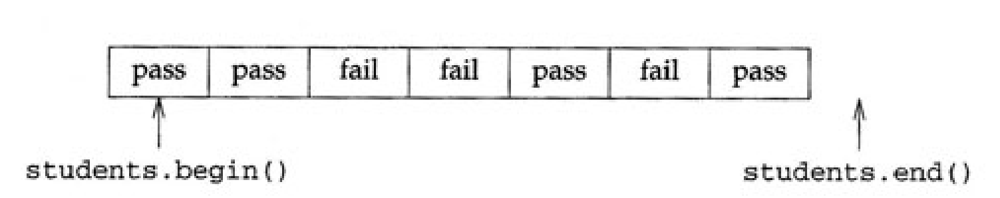
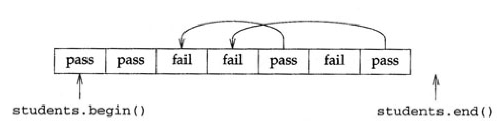
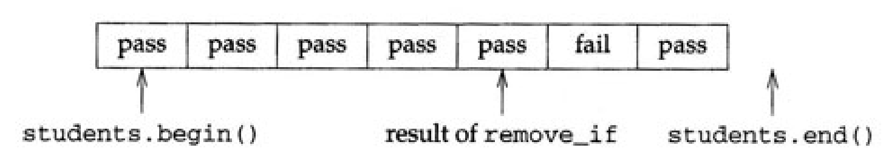
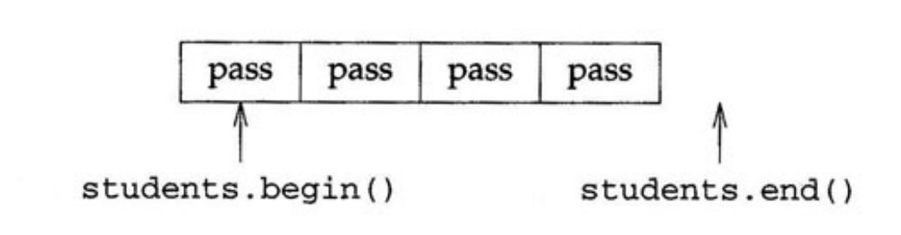
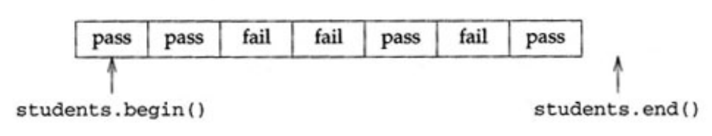
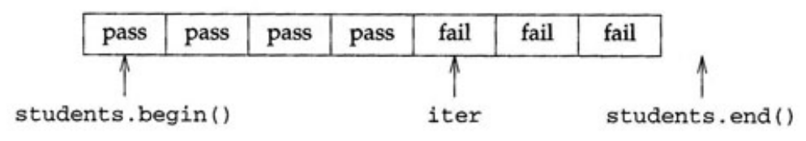

# 7. 연관 컨테이너

지금까지 살펴본 컨테이너는 순차컨테이너이다. 순차컨테이너의 요소들은 우리가 정한 순서를 유지한다.

push_back 함수나 insert 함수를 사용하여 요소를 추가할 때 컨테이너를 재정렬하는 동작을 실행하지 않는 이상 각 요소는 순서를 유지할 것이다.


순차 컨테이너만으로는 효율적으로 작성하기 어려운 유형의 프로그램이 있다. 예를 들어 정수 타입의 요소가 있는 컨테이너에서 값이 42인 요소를 찾는 프로그램을 작성할 때를 생각해보자

지금까지 학습한 내용으로는 2가지 방법으로 해결할 수 있지만 완벽한 방법이 아니다.

그 중 한 가지 방법은 42를 찾을 때까지 모든 컨테이너 요소를 탐색하는 것이지믄 요소가 많을 수록 느려진다.

다른 방법은 컨테이너 요소를 적절한 요소들을 적절한 순서로 유지하고 해당 요소를 찾는 효율 적인 알고리즘을 고안하는 방법이다. 이 방법은 빨리 탐색할 수 있지만 쉽지 않을 것이다.

다행이도 7장에서 라이브러리가 제공하는 또 다른 방법을 살펴볼 수 있다.


## 7.1 효율적인 탐색을 위한 컨테이너

데이터를 저장하는데 순차 컨테이너 대신 **연관 컨테이너**를 사용해 보자.

연관 컨테이너는 삽입한 순서가 아닌 값 순서로 순차열을 자동 정렬한다. 이 덕분에 연관 컨테이너에서는 우리가 직접 컨테이너를 조작할 필요가 없어 순차 컨테이너보다 훨씬 빠르게 특정 요소를 찾을 수 있다.


연관 컨테이너는 특정 값이 있는 요소를 찾는 효율적인 방법을 제공하며 추가 정보도 포함할 수 있다. 

효율적인 탐색에 사용할 수 있는 각 요소의 일부분을 **키**라고 한다. 예를 들어 학생 정보를 탐색한다면 학생들 이름을 키로 사용하여 효율적으로 원하는 학생 정보를 찾을 수 있다.


연관 데이터 구조의 가장 일반적인 형태는 키-값 쌍들을 저장하고 각 키와 값을 연관시킨 후, 키를 기반으로 요소들을 빠르게 삽입하고 탐색할 수 있는 구조이다. 

특정 키-값 쌍을 데이터 구조에 넣으면 그 키-값 쌍을 제거할 때까지 해당 키는 같은 값과 연관되어 있다. 이러한 데이터 구조를 **연관 배열**이라고 한다. 

C++ 에서 연관 배열을 라이브러리 일부이며 가장 일반적은 연관 배열은 **맵**이며 <map> 헤더에 정의된다.


맵은 많은 측면에서 벡터와 비슷하게 동작한다. 한 가지 차이점은 맵의 인덱스가 정수일 필요가 없다. 문자열일 수도 있고 서로 구분하는 값이 있는 다른 타입일 수도 있다.


또 다른 차이점은 연관 컨테이너는 자동으로 요소를 정렬하므로 요소 순서를 바꾸는 어떠한 동작도 실행하면 안된다.

따라서 컨테이너 내용을 변경하는 알고리즘은 종종 연관컨테이너에서 동작하지 않는다.

연관 컨테이너는 이러한 제약 조건이 없으므로 순차 컨테이너에서는 효율적으로 구현할 수 없는 다양한 연산을 제공한다.


## 7.2 단어의 빈도

간단한 예로 단어를 입력받으면서 개별 단어 빈도를 구하는 방법을 생각해 보자. 연관 배열을 사용한다면 손쉽게 해결할 수 있다.

```c++
int main()
{
	string s;

	// 각 단어와 빈도를 저장하는 맵
	// 입력을 읽으면서 각 단어와 빈도를 저장
	map<string, int> counters;

	while (cin >> s)
		++counters[s];

	// 맵에 저장된 각 단어와 빈도를 출력
	for (map<string, int>::const_iterator it = counters.begin(); it != counters.end(); ++it)
	{
		cout << it->first << "\t" << it->second << endl;
	}		
	return 0;
}
```

다른 컨테이너와 마찬가지로 맵에 있는 객체 타입을 지정해야 한다. 맵은 키-값 쌍이 있으므로 값의 타입 뿐만 아니라 키의 타입도 명시해야 한다.

```c++
map<string, int> counters;
```

즉, 앞 코드는 문자열 타입의 키와 int 타입의 값이 있는 맵인 counters를 정의한다. 문자열 타입의 키를 주고 int 타입의 연관된 데이터를 받는 방식으로 맵을 사용할 수 있다.


```c++
++counters[s];
```

여기서는 직전에 읽어 들인 단어를 키로 사용하여 counters에 접근한다. counters[s]는 s에 저장한 문자열과 관련된 정수값이다. 그리고 ++연산자를 사용하여 정수값을 증가시킨다. 이는 해당 단어하 한 번 더 등장 했다는 것을 나타낸다.

만약 읽어드린 단어가 처음 등장한 단어라면 counters에는 해당 단어를 키로 같는 요소가 아직 존재하지 않는다.

존재하지 않는 키로 접근할 때 맴은 해당 단어를 키로 갖는 새로운 요소를 자동으로 만든다. 이를 가리켜서 **값 초기화** 되었다고 한다. int타입이라면 0으로 초기화된다.


입력을 모두 읽었다면 해당 단어의 빈도를 출력하는데 map에서 list와 vector에 차이점은 for문에서 데이터를 출력하는 방법이다.

```c++
cout << it->first << "\t" << it->second << endl;
```

앞서 연관 배열은 키-값 쌍들을 저장한다고 언급하였다. map은 원래 (키,값)으로 데이터를 저장하지만 []연산자를 사용하면 값만 꺼내는 것처럼 보여서 이 구조가 잘 들어나지 않는다.

counters[s]가 실제로는 (키,값) 중에서 값(int)만 반환하기 때문에, 마치 int 변수처럼 보인다.

하지만 맵을 탐색하면서 키와 해당 키에 연관된 값을 모두 얻는 방법이 있어야 한다. 이와 같이 2개의 서로 다른 타입을 저장하려고 맵 컨테이너는 라이브러리 타입인 pair를 제공한다.


pair 타입은 2개의 요소로 first와 second가 있는 간단한 데이터 구조다. 실제로 맵의 각 요소는 pair 타입이다.

각 요소는 키를 포함하는 멤버변수 first와 해당 키와 연관된 값을 포함하는 멤버 변수 second가 있다.

pair 클래스는 다양한 타입의 값을 포함할 수 있다. 즉 pair클래스에 있는 값의 타입이 정해져 있지 않으므로 pair 타입의 객체를 만들 때 데이터 멤버 first와 second 타입을 지정해야 한다.

멤버 타입의 k와 v타입의 값이 있다면 해당 pair 타입의 형태는 pair<const k, v> 이다.

키의 타입이 const라는 것에 유의하자. 키 값은 바꿀수 없다. 그러므로 map<string, int> 반복자를 역참조하면 pair<const string, int>를 얻는다.

따라서 현재 요소의 키는 it->first이고 해당 키와 연관된 값은 it->second이다.

it는 반복자 이므로 *it는 lvalue이고 it->first와 it->second도 lvalue이다.


## 7.3 상호 참조 테이블

이번에는 입력한 문자열에서 각 단어가 몇 번째 행에 표시되는 지 상호 참조 테이블을 만들어 보자.

우선 한 번에 한 단어씩 읽어 들이는 대신 한 번에 한 행씩 읽어서 행 번호와 단어를 연관시킨다.

그 다음으로 각 행들을 단어들로 나눌 방법이 필요한데 6.1.1에서 만든 split함수를 사용할 수 있다.

split함수를 상호 참조 변수의 매개변수로 사용할 것이다.

그리고 이전과 마찬가지로 개별 단어를 키로 갖는 맵을 사용할 것이다. 하지만 이번에는 좀 더 복잡한 값을 키와 연관시켜야 한다. 단어 빈도가 아닌 단어가 등장한 모든 행 번호를 알아야 하고, 주어진 단어가 여러 행에 등장할 수 있으므로 행 번호를 컨테이너에 저장해야 한다.

또한 새로운 행 번호를 구하면 해당 단어에 이미 있는 행 번호 뒤에 새로운 행 번호를 추가해야 한다. 그러면 컨테이너 요소에 순차적으로 접근하는 동작이 필요하므로 행 번호를 저장할 때 벡터를 사용할 수 있다.

즉 문자열 타입에서 vector<int> 타입으로의 맵이 필요하다.

```c++
map<string, vector<int> > xref(istream& in,
vector<string> find_words(const string&) = split)
{
	string line;
	int line_number = 0;
	map<string, vector<int> > ret;

	// 다음 행을 읽음
	while (getline(in, line)) {
		++line_number;

		// 입력한 행을 단어로 나눔
		vector<string> words = find_words(line);

		// 현재 행에 등장한 모든 단어를 저장
		for (vector<string>::const_iterator it = words.begin(); it != words.end(); ++it)
			ret[*it].push_back(line_number);
	}
	return ret;
}
```

xref 함수의 반환 타입과 지역 변수 ret의 선언에서 >>로 작성하지 않고 > >으로 작성하였다. 가운데 공백 없이 >>로 작성하면 컴파일러는 >>연산자로 인식하므로 공백이 필요하다.


인수 목록에는 find_words 함수가 매개변수인 것에 주목하자. 이는 입력한 문자열을 단어로 나누려고 사용하는 함수를 xref함수에 전달하려는 의도이다.

중요한 점은 find_words 함수의 정의 뒤에 나오는 split인데, 매개변수인 find_words 함수에 **기본 인수**가 있음을 나타낸다.

매개변수에 기본 인수를 지정하면 함수를 호출할 때 해당 인수를 생략할 수 있다.

함수를 호출할 때 인수를 전달하면 전달한 인수를 사용하지만 생략하면 기본 인수를 사용한다. 따라서 xref 함수는 다음 두가지 방법 중 한가지를 사용하여 호출할 수 있다.

```c++
xref(cin); // split 함수를 이용하여 입력 스트림에서 단어를 찾음
xref(cin, find_urls) // find_urls 함수를 사용하여 단어를 찾음
```

xref 함수 본문을 보면 각 행을 저장할 문자열 타입인 변수 line과 현재 처리 중인 행의 번호를 저장할 line_number를 정의한다.

입력작업은 getline(5.7) 함수를 호출하여 한 행씩 읽어 line에 저장하고 line_number를 증가시키고 행의 각 단어를 구분하여 처리한다.

line에 저장된 행의 모든 단어를 저장할 때는 지역 변수 words를 선언하고 fine_words함수를 호출하여 초기화 한다.

이어서 for문으로 words의 각 요소를 탐색하면서 ret의 내용을 갱신하는데 이 부분을 살펴 보자

```c++
ret[*it].push_back(line_number);
```

여기서 반복자 it는 words 벡터의 요소 하나를 카리키며 *it는 입력한 행을 구성하는 단어 중 하나이다.

그리고 그 단어를 맵의 인덱스로 활용한다.

표현식 ret[*it]는 맵에서 인덱스가 *it인 위치에 저장하는 값을 반환한다. 이 값은 지금까지 해당 단어가 등장한 행 번호들을 저장한 vector<int> 타입 객체고, 벡터의 멤버함수인 push_back을 호출하여 현재의 행 번호를 추가한다.


단어가 처음 등장하면 vector<int>타입의 객체는 '값 초기화'가 된다. 벡터 타입 객체의 값 초기화는 초기값을 할당하지 않는 벡터 타입의 변수를 새로 생성한다.

따라서 새로운 문자열 키를 맵에 삽입할 때는 비어있는 vector<int> 타입 객체와 연관된다. push_back 함수를 호출하면 비어있는 벡터에 현재 행 번호를 추가할 것이다.


지금까지 살펴본 xref 함수를 사용하여 상호 참조 테이블을 만들어 보자.

```c++
int main()
{
	map<string, vector<int> > ret = xref(cin);

	// 결과 출력
	for (map <string, vector<int> >::const_iterator it = ret.begin(); it != ret.end(); ++it) {
		// 단어를출력
		cout << it->first << " occurs on line(s): ";

		// 이어서 하나 이상의 행 번호를 출력
		vector<int>::const_iterator line_it = it->second.begin();
		cout << *line_it;
		++line_it;

		// 행 번호가 있으면 마저 출력
		while(line_it != it->second.end()) {
			cout << ", " << *line_it;
			++line_it;
		}

		cout << endl;
	}
	return 0;
}
```

처음에는 xref 함수를 호출하여 각 단어가 등장하는 행 번호를 저장한 데이터 구조를 만든다.

xref 함수의 두 번째 인수로 기본 인수를 사용하므로 split 함수를 사용하여 입력한 문자열을 개별 단어로 분리한다.

프로그램 나머지 부분에서는 xref 함수가 반환하는 데이터 구조의 내용을 출력한다.

for문에서는 ret의 첫번째 요소부터 순차적으로 모든 요소를 살펴본다.

맵 반복자를 역참조하면 pair 타입의 값을 반환한다는 사실을 기억하자. pair타입의 객체의 first 요소는 키이고 second요소는 해당 키와 연관된 값이다.

for문의 본문은 다음처럼 처리 중인 단어와 메시지를 출력하는 것으로 시작한다.

```c++
cout << it->first << " occurs on line(s): ";
```

현재 처리 중인 단어는 반복자 it와 관련된 맵의 ret 키이다. 반복자를 역참조하여 이 떄 반환하는 pair 타입 객체의 first 요소를 가져와 키를 얻는다.

어떤 단어게 ret의 요소라면 최소 한번 이상 등장한 단어이다. 하지만 현재 시점에서 해당 단어가 두 번 이상 등장했는지 알 수 없으므로 출력한 행 번호가 남아있는지 모호한 상태다.

it->first가 key인 것처럼 it->second는 연관된 값이다. it->second는 현재 처리 중인 단어가 등장한 행 번호를 저장한 vector<int>타입 객체이다. it->second의 요소에 접근하려고 반복자 line_it를 정의한다.


행 번호들은 쉼표를 사용하여 구분할 것이다. 의미 없는 쉼표의 출력을 방지하려면 첫번째 요소나 마지막 요소를 신경써서 다뤄야 한다.

ret의 모든 요소는 최소 한 번 등장한 단어를 나타내므로 명시적으로 출력하는 것이 안전하다.

첫 번째 요소를 출력했으므로 반복자를 증가시킨다. 그런 다음 vector<int> 타입 객체에 남은 요소가 있다면 while문에서 나머지 요소의 출력을 반복한다. 각 요소의 쉼표 다음 요소 값을 출력한다.


## 7.4 문장 만들기

좀더 복잡한 예제를 만들어보자, 맵을 사용한 문장 구조 설명, 즉 문법으로 임의의 문장을 만드는  프로그램을 작성할 수 있다.

예를 들어 영어 문장은 명사, 동사로 구성하거나 명사, 동사, 목적어 등으로 구성할 수 있다.

복잡한 문법을 적용할 수 있다면 문장이 더 다채로워진다. 예를 들어 명사와 동사로 구성된 문장이 아니라 명사구를 허용하여 단순 명사 뿐만 아니라 형용사와 명사구를 결합한 또 다른 명사구를 넣을 수 있다.

구체적인 예로 다음과 같은 문법 테이블로 임의 문장을 만드는 프로그램이 있다고 가정해 보자.

| 분류   | 규칙                       |
| ------ | -------------------------- |
| 명사   | cat                        |
| 명사   | dog                        |
| 명사   | table                      |
| 명사구 | <명사>                     |
| 명사구 | <형용사> <명사구>          |
| 형용사 | large                      |
| 형용사 | brown                      |
| 형용사 | absurd                     |
| 동사   | jumps                      |
| 동사   | sits                       |
| 위치   | on the stairs              |
| 위치   | under the sky              |
| 위치   | wherever it wants          |
| 문장   | the <명사구> <동사> <위치> |

프로그램이 다음과 같은 문장을 만드는 과정을 살펴보자

```c++
the table jumps wherever it wants
```

프로그램의 처음에는 항상 문장을 만드는 규칙을 찾는 동작을 실행한다. 문장을 만드는 규칙은 표의 마지막에 있다.

```
the <명사구> <동사> <위치>
```

the, 명사구, 동사, 장소 순서로 문장을 만드는 규칙이다. 먼저 프로그램은 <명사구>에 해당하는 규칙을 임의로 선택한다. 해당 규칙은 다음과 같다.

```c++
<명사>
```

그리고 명사 자리에는 다음 규칙을 사용한다.

```
table
```

동사 자리에는 다음 규칙을 사용한다.

```
jumps
```

장소 자리에는 다음 규칙을 사용한다.

```
wherever it wants
```


### 7.4.1 문법 테이블 표현

문자를 다루는 라이브러리를 사용하여 거꾸로 읽어도 철자가 같은 단어들을 찾는 함수를 만들어 보자

```c++
bool is_palindrome(const string& s)
{
	return equal(s.begin(), s.end(), s.rbegin());
}
```

반환문에서 equal과 멤버함수 rbegin을 호출한다. begin 함수와 마찬가지로 rbegin 함수도 반복자를 반환한다.

rbegin 함수가 반환하는 반복자는 컨테이너의 마지막 요소에서 시작하여 컨테이너를 거꾸로 통과한다.


equal 함수는 순서가 반대인 두 문자열이 같은 값인지 판별하려고 두 순차열을 비교한다. 인수로 전달하는 첫 2개의 반복자는 첫 번째 순차열의 범위를 나타내며, 세 번째 인수는 두번째 순차열의 시작점을 나타낸다.

equal 함수는 두 번째 순차열이 첫 번째 순차열과 같은 크리가로 가정하기에 두번째 순차열의 끝을 가리키는 반복자는 필요하지 않다.

두번쨰 순차열의 시작점으로 s.rbegin()을 전달하므로 equal 함수를 호출하면 s의 앞과 뒤를 비교한다. 즉 s의 첫 번째와 마지막 문자를 비교한 후, 두 번째 문자의 마지막에서 두 번째 문자를 비교하는 순서대로 동작한다.


### 6.1.3 URL 찾기

문자를 마지막으로 URL을 찾는 함수를 작성해보자. URL은 다음 형태를 갖는 문자들의 순차열이다.

```
프로토콜 이름 :// 리소스 이름
```

'프로토콜 이름'은 문자만으로 구성되고 '리소스 이름'은 문자,숫자 특정 구두문자로 구성된다.

문자열 인수를 전달 받아 해당 문자열이 포함하는 ://를 찾고 각각 ://를 발견할 때마다 그것을 기준으로 앞에 오는 '프로토콜 이름'과 뒤에 오는 '리소스 이름'을 찾는다.


인수로 전달된 문자열에 있는 모든 URL을 찾아야 한다. 따라서 함수는 URL 각각을 요소 하나로 같는 vector<string>을 반환할 것이다. 반복자 b를 사용하여 문자열 내부를 이동하여 ://를 찾고 앞은 프로토콜 이름 뒤는 '리소스 이름'을 찾을 것이다.

```c++
vector<string> find_urls(const string& s)
{
	vector<string> ret;
	typedef string::const_iterator iter;
	iter b = s.begin(), e = s.end();

	//인수로 전달받은 문자열 전체를 탐색
	while (b != e) {
		// :// 앞쪽에서 하나 이상의 문자를 탐색
		b = url_beg(b, e);
		if (b != e) {
			// 해당 문자를 찾았다면 나머지 부분을 탐색
			iter after = url_end(b, e);

			// URL을 저장
			ret.push_back(string(b, after));

			// 인수로 전달받은 문자열에서 또 다른 URL을 찾기 위해 b를 증가
			b = after;
		}
	}
	return ret;
}
```

앞 코드는 문자열에서 찾은 URL을 저장할 ret 벡터와 문자열 범위를 나타내는 반복자를 선언한다.

각 URL의 시작과 끝을 찾을 때 url_beg함수와 url_end 함수를 작성해야 한다.

url_beg 함수는 유효한 URL이 있는 지 식별하여 유효한 URL이면 프로토콜 이름의 첫 번째 문자를 참조하는 반복자를 반환한다. URL을 식별하지 못하면 두 번째 인수인 e를 반환한다.

url_beg 함수가 URL을 찾고난 후 다음엔 url_end 함수를 호출하여 URL에 끝을 찾는 것이다.

url_end 함수는 인수로 주어진 지점부터 find_urls의 인수로 전달된 문자열에 끝이나 URL의 일부가 아닌 문자에 도달할 때까지 URL을 찾아서 URL의 마지막 문자 이후를 참조하는 반복자를 반환한다. 따라서 url_beg함수와 url_end 함수를 호출한 후 반복자 b는 URL의 시작점을 가리키며 반복자 after는 URL의 마지막 문자  이후를 가리킨다.

남은 과정은 b를 증가시키고 다음 순서에 url을 찾으면 된다

    b = url_beg(b, e)
              ↓
    
    [text http] [://] [www.acceleratedcpp.com] [more text]
                                                   ↑
                                                   e (끝)
        				           ↑
    	     			after = url_end(b, e)


url_end 함수부터 살펴보자

```c++
string::const_iterator url_end(string::const_iterator b, string::const_iterator e)
{
	return find_if(b, e, not_url_char);
}
```

여기서 not_url_char 함수는 인수로 전달된 문자가 URL에 속할 수 없는 문자일 때 참을 반환한다.


```c++
bool not_url_char(char c)
{
	// URL에 포함될 수 있는 문자를 나열한 문자열
	static const string url_ch = "~;/?:@=&$-_.+!*'(),";

	// c가 URL에 들어갈 수 있는 문자인지 확인하면 음수를 반환
	return !(isalnum(c) || find(url_ch.begin(), url_ch.end(), c) != url_ch.end());
}
```

**static**은 **스토리지 클래스 지정자**라고 한다. static으로 선언한 지역 변수는 함수를 반복해서 호출하더라도 값이 보존된다. 따라서 not_url_char 함수의 첫 번째 호출ㄹ에서만 문자열 url_ch를 만들고 초기화 한다. 

isalnum 함수는 <cctype> 헤더가 정의하며 인수로 전달한 문자가 알파벳이나 숫자인지 여부를 판별한다.

find 함수는 find_if 함수와 비슷하지만 서술함수를 호출하는 대신 세 번째 인수로 주어진 특정한 값을 찾는다. 찾으려는 값이 존재하면 주어진 순차열에서 해당 값의 첫 번째 출현 지점을 가리키는 반복자를 반환하고 값이 존재하지 않으면 두번째 인수를 반환한다.

이 함수는 c가 알바벳 또는 숫자 또는 문자열 url_ch에 속한 문자 중 하나일 때 not_url_char 함수는 거짓을 반환한다.

c가 그 외의 값이면 not_url_char 함수는 참을 반환한다.


url_beg을 구현해 보자 ://를 포함하지만 URL이 될 수 없을 때도 고려해야 하므로 다소 복잡하다. 프로토콜 이름의 목록에 국한되지 않고 :// 앞뒤로 유효한 문자가 하나라도 있다면 URL로 인식하게끔 구현할 것이다.

```c++
string::const_iterator url_beg(string::const_iterator b, string::const_iterator e)
{
	static const string sep = "://";
	typedef string::const_iterator iter;

	// i는 구분 기호를 발견한 위치를 표시
	iter i = b;
	while ((i = search(i, e, sep.begin(), sep.end())) != e) {
		// 구분 기호가 현재  탑색 범위의 처음 또는 마지막에 있는지 확인
		if (i != b && i + sep.size() != e) {
			// beg은 프로토콜 이름의 시작 위치를 표시
			iter beg = i;
			while (beg != b && isalnum(beg[-1]))
				--beg;

			if (beg != i && not_url_char(i[sep.size()]))
				return beg;
		}
		i += sep.size();
	}
	return e;
}
```

이 함수는 다음 그림처럼 b와 e 사이의 범위를 갖는 문자열에서 2개의 반복자를 사용하여 동작한다.

반복자 i는 url 구문 기호 시작점, beg은 프로토콜 이름의 시작점을 가리킨다.

라이브러리 함수인 search 함수를 호출하여 구분 기호를 찾는다. search 함수는 두 쌍의 반복자를 인수로 갖는다.

첫번째 쌍은 탐색할 순차열, 두번째 쌍은 찾고자 하는 순차열을 나타낸다. 순차열을 발견하지 못하면 두 번째 인수에 해당하는 반복자자를 반환한다. 따라서 search 함수의 호출이 끝난 후에 i는 url_beg 함수에 전달된 문자열의 마지막 지점 다음을 가리키거나 발견한 구분 기호에  ':'에 해당하는 지점을 가리킨다.


구분 기호를 발견한 이후에는 프로토콜 이름을 구성하는 문자들을 찾는다. 먼저 구분 기호가  현재 탐색 범위의 처음 또는 마지막에 있는지 확인한다.

URL은 구분기호 양쪽에 최소한 문자 하나씩은 있어야 한다. 발견한 구분 기호가 탐색 범위의 처음 또는 마지막에 있으면 해당 구분 기호는 url의 일부가 아니다.

만약 구분 기호의 위치가 처음 또는 마지막이 아라면 프로토콜의 이름의 시작점인 반복자 beg의 위치를 구해야 한다.


내부의 while문은 알파벳이 아닌 문자나 현재 탐색 범위의 처음에 도달할때까지 반복자 beg를 거꾸로 이동시킨다.

새로운 두가지 개념을 사용하는데 첫번째 개념은 컨테이너가 인덱스를 지원하면 반복자도 인덱스를 지원한다는 사실이다. 즉, beg[-1]은 beg가 가리키는 문자 바로 전 문자를 의미한다.

beg[-1]은 *(beg -1)을 줄여 표현한 것이다.

isalpha 함수는 전달된 인수가 문자인지 판별한다.

반복자 beg을 적어도 문자 하나만큼 앞당길 수 있다면 프로토콜의 이름을 찾은 것이며, beg을 반환하기 전에 구분 기호 다음으로 유효한 문자가 하나라도 있는지 확인해야 한다. 이를 판별하는 코드는 다소 복잡한데,

i+sep.size()의 값을 e와 비교하여 같지 않을 때 실행할 수 있는 본문이다. 따라서 구분 기호 뒤에는 적어도 하나의 문자가 존재한다.

i[sep.size()]를 사용하면 구분 기호 이후에 첫 번째 문자에 접근할 수 있다. 해당 문자를 not_url_char 함수에 전달하여 URL의 일부로 유효한 문자인지 판별한다.

발견한 구분 기호가 URL의 일부가 아니라면 해당 구분 기호 이후를 표시하도록 i를 구분 기호의 크기만큼 증가시키고 다음 구분 기호를 찾는다.


## 6.2 성적 산출 방식 비교

4.2에서 과제 점수의 중앙값에 기반하여 학생의 최종 점수를 구하는 성적 산출 방식을 살펴보았다.

근데 만약 고의적으로 과제를 제출하지 않고 이렇게 악용할 수 있다.

과제 점수의 절반 가까이는 최종 점수에 아무런 영향을 주지 않으므로 최종 점수를 잘 받을 만큼에 과제 점수를 확보하면 더 이상 과제를 할 필요가 없다.

그럼 다음과 같이 이 문제를 해결하려고 한다.

- 중앙 값 대신 평균값을 사용한다. 제출하지 않는 과제는 0점으로 처리한다.
- 학생이 실제로 제출한 과제 점수들 만으로 중앙값을 산출한다.

각 성적 산출 방식을 적용하여 모든 과제를 제출한 학생들의 최종 점수 중앙값과 하나 이상의 과제를 빼먹은 학생들의 최종 점수 중앙값을 비교해 보자. 다음 처럼 두 부분으로 나누어 해결할 수 있다.

1. 모든 학생의 정보를 읽고 과제를 모두 제출한 학생과 그렇지 않은 학생들을 분류한다.
2. 두 집단에 각각의 성적 산출 방식을 적용한 후 각 집단의 중앙값을 추출한다.


### 6.2.1 학생 분류

4.2.1에서 살펴본 Student.info 타입과 4.2.2에서 살펴본 read함수를 사용하여 학생 정보를 읽을 수 있다.

학생들이 모든 과제를 제출했는지 확인하는 함수를 만들어 보자

```c++
bool did_all_hw(const Student_info& s)
{
	return ((find(s.homework.begin(), s.homework.end(), 0)) == s.homework.end());
}
```


이전에 만든 read 함수와 방금 살펴본 did_all_hw 함수를 사용하여 학생 정보를 읽고 분류하는 코드를 만들 수 있다.

```c++
vector<Student_info> did, didnt;
Student_info students;

// 학생 정보를 읽고 과제를 모두 제출한 학생과 그렇지 않은 학생을 구분하여 저장
while (read(cin, students)) {
	if (did_all_hw(students))
		did.push_back(students);
	else
		didnt.push_back(students);
}

// 두 집단에 데이터가 있는지 확인
if (did.empty()) {
	cout << "No student did all the homework!" << endl;
	return 1;
}

if (didnt.empty()) {
	cout << "Every student did all the homework!" << endl;
	return 1;
}
```

새로운 empty함수가 나왔다. empty 함수는 해당 컨테이너가 비어있으면 True 그렇지  않으면 false를 반환한다.

컨테이너가 비어있는지 확인하려면 size의 반환값이 0인 것을 확인하는 것보다 empty 함수를 사용하는 것이 더 낫다.

컨테이너 종류에 따라 정확히 몇 개의 요소가 있는지 확인하는 것보다 컨테이너에 요소가 있는지 확인하는 것이 더 효율적이기 때문


### 6.2.2 수학적 분석

분류한 학생 정보를 구조화 하는 법을 생각해 보자.

우선 실행해야 할 분석은 3가지다.

1. 중간값 기반 분석
2. 평균 기반 분석
3. 0점 제외한 중간값 분석

이렇게 3함수를 만들면 did벡터와 didnt벡터에 호출하는 과정을 3번 반복하게 된다. 각기 다른 분석 함수로 해당 결과를 출력할 수 있도록 만들어야 한다.

가장 편한 방법은 3개의 분석 함수를 정의하고, 각각을 출력 함수의 인수로 전달하는 것이다.

4.2.2에서 sort를 사용할 때 compare함수를 인수로 전달한 것처럼 하면 된다.


출력 함수는 5개의 인수가 필요하다.

- 출력 스트림
- 무엇을 출력하는지 나타내는 문자열
- 사용한 분석 함수
- 분석 대상인 2개의 벡터

예를 들어 중앙값으로 분석하는 함수의 이름이 median_analysis이고, 다음 코드를 실행하여 2개의 학생 집단을 분석한 결과를 출력한다고 가정해보자

```c++
write_analysis(cout, "median", median_analysis, did, didnt);
```


이 함수를 정의하기 앞서 median_analysis를 정의해보자. 학생 정보가 있는 벡터를 인수로 전달한다.

그리고 기존 성적 산출 방식에 따라 학생들의 최종 점수를 계산한 후, 최종 점수들의 중앙값을 반환하도록 다음처럼 함수를 정의할 수 있다.

```c++
// 이 함수는 제대로 동작하지 않음
double median_analysis(const vector<Student_info>& students)
{
	vector<double> grades;
	transform(students.begin(), students.end(), back_inserter(grades), grade);
	return median(grades);
}
```

transform 함수의 인수는 3개의 반복자와 1개의 함수이다.

첫 2개의 반복자는 최종 점수를 계산할 학생 정보의 범위, 세번째 반복자는 학생들의 최종 점수를 저장할 위치를 나타낸다.

transform 함수를 호출할 때는 최종 점수를 저장하는 저장 공간이 충분한 지 확인해야 한다. 여기 학생들의 최종 점수를 저장할 공간을 확보하는 문제는 back_inserter 함수를 호출하여 해결한다. 즉, 필요한 만큼 자동으로 공간을 확장하면서 학생들의 최종 점수를 grades 벡터에 추가할 것이다.

transform 함수의 4번째 인수는 transform 함수가 전달 받은 첫 2개의 반복자가 타나내는 범위의 요소들이 세번째 반복자가 나타내는 위치에 저장 되기 전 거쳐야할 함수이다.

따라서 transform 함수를 호출하면 students 벡터 각 요소에 grade 함수를 적용하여, 그 결과를 grades 벡터에 추가한다.

모든 학생의 최종 점수를 구했다면 median 함수를 호출하여 최종 점수들의 중앙값을 계산한다.

하지만 주석에 적혀있듯 앞서 살펴본 함수는 제대로 동작하지 않는다. 왜냐하면 grade 함수가 여러 개의 버전으로 오버로드된 함수이기 때문이다.

grade함수에 인수를 전달하지 않았으므로 컴파일러는 호출할 grade 함수의 버전을 알지 못한다. 따라서 어떤 버전의 grade 함수를 호출할 지 컴파일러에게 알려줘야 한다.

또한 과제를 전혀 하지 않은 학생이 있을 grade함수가 던지는 예외에 대한 transform 함수는 아무 동작을 실행하지 않는다.

예외가 발생하면 transform함수는 예외가 발생한 지점에서 동작을 멈추고 median_analysis 함수로 돌아가는데 median_analysis함수도 예외를 처리하지 않으므로 해당 예외는 계속해서 밖으로 전파된다.


grade 함수에서 발생하는 예외를 처리하는 보조 함수를 작성하면 동작하지 않는 원인들을 모두 해결할 수 있다.

grade 함수를 transform 함수의 인수로 전달하지 않고 보조함수를 명시적으로 호출하면 우리가 의도한 grade 함수 버전을 파악할 수 있다

```c++
double grade_aux(const Student_info& s)
{
	try {
		return grade(s);

	}
	catch (domain_error) {
		return grade(s.midterm, s.final, 0);
	}
}
```

grade_aux 함수는 4.2.2에서 살펴본 grade 함수를 호출하고, 예외가 발생했을 시 다른 버전의 grade 함수를 호출한다.

```c++
// 이 코드는 제대로 동작
double median_analysis(const vector<Student_info>& students)
{
	vector<double> grades;
	transform(students.begin(), students.end(), back_inserter(grades), grade_aux);
	return median(grades);
}
```


이제 writd_analysis 함수를 정의해보자. writd_analysis 함수는 분석 함수를 사용하여 두 학생 집단을 비교한다.

```c++
void write_analysis(ostream& out, const string& name,
	double analysis(const vector<Student_info>&), const vector<Student_info>&  did, const vector<Student_info>& didnt)
{
	out << name << ": median(did) = " << analysis(did) <<
		", median(didnt) = " << analysis(didnt) << endl;
}
```

write_analysis 함수에서는 두 가지 새로운 개념을 사용한다.

1. 함수를 매개변수로 전달하는 것
2. 반환 타입이 void

함수가 void를 반환한다는 것은 실제로 반환 값이 존재하지 않는다는 것을 의미한다. 

```c++
return;
```

값이 없는 반환문을 실행하여 함수를 빠져나올 수 있다.


```c++
int main()
{
	vector<Student_info> did, didnt;
	Student_info students;

	// 학생 정보를 읽고 과제를 모두 제출한 학생과 그렇지 않은 학생을 구분하여 저장
	while (read(cin, students)) {
		if (did_all_hw(students))
			did.push_back(students);
		else
			didnt.push_back(students);
	}


	// 두 집단에 데이터가 있는지 확인
	if (did.empty()) {
		cout << "No student did all the homework!" << endl;
		return 1;
	}

	if (didnt.empty()) {
		cout << "Every student did all the homework!" << endl;
		return 1;
	}

	write_analysis(cout, "median", median_analysis, did, didnt);
	write_analysis(cout, "average", average_analysis, did, didnt);
	write_analysis(cout, "median of homework turned in", optimistic_median_analysis, did, didnt);
}
```

main 함수를 작성하였고 average_analysis와 optimistic_median_analysis를 작성해보자


### 6.2.3 과제 점수의 평균 값을 사용한 성적 산출

average_analysis 함수를 작성해보자.

```c++
double average(const std::vector<double>& v)
{
	return accumulate(v.begin(), v.end(), 0.0) / v.size();
}
```

accumulate 함수는 <numeric> 헤더에 선언되어 있으며 첫 2개의 인수 범위 값을 더하여, 세번째 인수로 주어진 값을 합하는 과정을 시작한다.

총합 타입은 세번째 인수 타입으로 결정되므로 0 대신 0.0을 사용해야 한다. 0으로 사용하면 결과는 int 타입이 되어 소수 부분이 손실된다.

모든 요소의 합을 구한 후 그 결과를 범위 안 요소 개수인 v.size()로 나눈다.


average 함수를 사용해서 average_grade 함수를 구현해 보자

```c++
double average_grade(const Student_info& s)
{
	return grade(s.midterm, s.final, average(s.homework));
}
```


average_analysis 함수를 작성해보자

```c++
double average_analysis(const vector<Student_info>& students)
{
	vector<double> grades;
	transform(students.begin(), students.end(), back_inserter(grades), average_grade);
	return median(grades);
}
```


### 6.2.4 제출한 과제 점수의 중앙값

마지막으로 살펴볼 분석 방식은 optimistic_median_analysis 함수이다. 이 함수는 제출하지 않은 과제 점수가 제출한 과제 점수가 같았을 것이라는 낙관적 가정에서 이름을 딴 함수이다. **즉, 제출된것만 것만 가지고 계산한다.**

이러한 가정 아래 각 학생이 제출한 과제 점수의 중앙값을 계산하고자 한다. 따라서 낙관적 중앙값을 계산하는 함수를 작성할 것이다. 물론 학생이 과제를 전혀 제출하지 않았을 가능성을 고려해야한다. 이때는 과제 점수를 0점으로 처리할 것이다.

```c++
double optimistic_median(const Student_info& s)
{
	vector<double> nonzero;
	remove_copy(s.homework.begin(), s.homework.end(), back_inserter(nonzero), 0);

	if (nonzero.empty())
		return grade(s.midterm, s.final, 0);
	else
		return grade(s.midterm, s.final, median(nonzero));
}
```

optimistic_median 함수는 homework 벡터에서 0이 아닌 요소들을 추출해 새로 만든 nonzero 벡터에 저장한다.

remove_copy 알고리즘은 remove 알고리즘의 동작을 실행하고 그 결과를 지정한 대상으로 복사한다.

remove_copy 알고리즘은 3개의 반복자와 1개의 값을 인수로 갖는다. 첫 2개의 반복자는 탐색할 범위를 나타내고 세번쨰 반복자는 복사한 값을 저장할 대상의 시작점을 나타낸다.

remove_copy알고리즘은 copy 알고리즘과 마찬가지로 복사된 모든 요소를 저장할 공간이 충분하다고 가정한다.

nonzero 벡터를 필요한 만큼 확장하려고 back_inserter 함수를 호출한다.

remove_copy 알고리즘을 사용한다는 것은 s.homework 벡터에서 0이 아닌 모든 요소를 nonzero벡터의 복사하는 것이다.

그 다음 nonzero 벡터가 비어있는지 확인하고 그렇지 않으면 벡터의 저장값들의 중앙값으로 최종 점수를 계산한다. nonzero벡터가 비어있으면 종합 과제 점수는 0점으로 처리한다.

```c++
double optimistic_median_analysis(const vector<Student_info>& students)
{
	vector<double> grades;
	transform(students.begin(), students.end(), back_inserter(grades), optimistic_median);
	return median(grades);
}
```


## 6.3 학생 분류 방식 살펴보기

5.1에서 과락한 학생들의 정보를 별도의 벡터로 복사한 다음 기존 벡터에서 해당 정보를 제거하는 문제를 다루었다.

다루어야 할 학생 수가 많아질 수록 성능이 급격히 떨어졌기에 성능 문제를 해결하려고 벡터 대신 리스트를 사용했다.

리스트를 사용하는 방법 외의 비슷한 성능을 가진 알고리즘을 사용하는 방법이 있다.

알고리즘 라이브러리를 사용하면 두가지 방법으로 문제를 해결할 수 있다. 

첫번째는 약간 느린 방법으로 한 쌍의 라이브러리 알고리즘을 사용하여 모든 요소를 두 번씩 탐색하며, 

두번째는 더 특성화된 라이브러리 알고리즘으로 보든 요소를 한 번씩 탐색하여 문제를 해결할 수 있다.


### 6.3.1 벡터를 두 번 탐색하는 방식

첫번째 접근 법은 6.2.4에서 살펴본 것과 비슷한 방법을 사용한다. 6.2.4에서 0이 아닌 과제 점수를 추출할 때 homework 벡터 자체를 바꾸지 않고 remove_copy알고리즘을 사용하여 별도 벡터에 0점이 아닌 과제 점수들의 복사본을 전달하였다.

지금 다루는 문제에서는 과락 학생의 요소를 복사하는 동작과 제거하는 동작이 모두 필요하다.

```c++
vector<Student_info> extract_fails(vector<Student_info>& students)
{
	vector<Student_info> fails;
	remove_copy_if(students.begin(), students.end(),
		back_inserter(fails), pgrade);

	students.erase(remove_if(students.begin(), students.end(), fgrade),
		students.end());

	return fails;
}
```

remove_copy_if 함수를 이용하여 과락 학생들의 정보를 fail 벡터로 복사한다. remove_copy_if 함수는 조건을 판별하려고 값 대신 서술함수를 네 번째 인수로 전달한다.

remove_copy_if 함수에서는 서술함수를 만족하는 각 요소들을 복사하지 않고, 조건을 만족하지 않는 요소만 결과 컨테이너에 복사한다.

따라서 pgrade를 사용하면 통과 학생은 제외되고 낙제 학생만 복사된다.


그 다음 실행문의 erase 함수는 복잡한데, 먼저 remove_if 함수는 조건을 만족하는 요소를 실제로 삭제하지 않고,
 조건을 만족하지 않는 요소만 앞으로 이동시킨다. 이 과정에서 통과 학생들의 정보가 앞쪽으로 복사되고, 낙제 학생들은 뒤쪽으로 밀려난다. 이후 erase를 사용하여 뒤쪽에 남은 낙제 학생들을 실제로 제거한다.

즉 remove_if 함수의 실제 동작은 서술함수를 만족하지 않은 요소들을 복사하여 다시 students 벡터의 처음부터 차례로 덮어 씌우는 것이다.

예를 들어 다음과 같이 7명의 학생이 있다고 가정해 보자



그리고 remove_if 함수를 호출하면 첫 두 학생의 정보는 이미 올바른 위치이므로 바꾸지 않는다. 그 다음의 두 학생의 정보는 보관해야할 다음 학생 정보를 덮어 쓸 여유 공간을 마련하고 제거된다. 따라서 다섯번째 학생이 통과된 것을 확인하면 해당 학생 정보를 여유공간으로 복사한다. 이 때 여유공간은 과락하여 제거된 첫 번째 학생 정보가 저장되어 있던 공간이다.



이러한 방식을 반복하면 4개의 학생 정보는 벡터의 처음부터 차례로 복사되고 나머지 3개의 학생 정보는 그대로 남게 된다.

remove_if 함수는 제거하지 않은 마지막 요소 이후를 참조하는 반복자를 반환하여 벡터에서 어느 요소까지 의미 있는지 알려준다.



다음은 erase 함수를 사용하여 students 벡터에서 불필요한 학생 정보를 없애야 한다.

erase 함수는 2개의 반복자를 인수로 전달 받고 해당 반복자가 나타내는 범위의 모든 요소를 지워버린다.

remove_if 함수를 호출했을 때 반환하는 반복자와 students.end() 사이의 요소들을 지워버리면 students 벡터에는 통과한 학생의 정보만 남게 된다.




### 6.3.2 벡터를 한번 탐색하는 방식

위의 탐색방식의 성능은 뛰어나지만 조금 더 손봐야 할 부분이 있다.

6.3.1에서 살펴본 방식은 remove_copy_if 함수와 remove_if 함수에서 모든 요소의 최종 점수를 각각 한 번씩 총 두번 계산하기 때문이다.

해결해야할 문제를 다른 각도로 접근하는 알고리즘이 있다. 이 알고리즘은 하나의 순차열을 인수로 전달 받고 서술함수를 만족시키는 요소들을 그렇지 않은 요소들보다 앞쪽에 위치하도록 순차열 안 요소들을 재배치 한다.

이 알고리즘은 2가지 버전이 있는데 partition 함수와 stable_partition 함수이다.

partition 함수는 요소들을 카테고리로 구분하여 재배치하고 stable partition 함수는 각 카테고리 안에서 요소 순서를 유지하면서 재배치한다.

예를 들어 학생들의 정보가 학생 이름을 기준으로 알파베 순으로 정렬되어 있고 각 카테고리 안에서 순서를 유지하려면 stable_partition 함수를 사용해야 한다.

이러한 알고리즘은 두 번째 카테고리의 첫 번째 요소를 나타내는 반복자를 반환한다. 따라서 다음과 방식으로 과락 학생들의 정보를 추출할 수 있다.

```c++
vector<Student_info> extract_fails(vector<Student_info>& students)
{
	vector<Student_info>::iterator iter = stable_partition(students.begin(), students.end(), pgrade);
	vector<Student_info> fails(iter, students.end());
	students.erase(iter, students.end());
	return fails;
}
```


이해하기 쉽게 앞서 가정한 7명의 학생들을 다시 살펴보자



stable_partition 함수를 호출하면 재배치 결과는 다음과 같다.



과락 학생을 의미하는 [iter, students.end()) 범위의 요소들을 복사하여 fail 벡터를 만든 다음 students 벡터에서 해당 요소를 지워버린다.

입력 데이터의 크기가 커질수록 알고리즘 및 리스트에 기반하여 문제를 해결하는 방식은 벡터에 기반하여 erase 함수로 문제를 해결하는 것보다 성능이 뛰어나다.


## 6.4 알고리즘, 컨테이너, 반복자

알고리즘, 반복자, 컨테이너를 사용할 때 이해해야 할 중요한 사실이 있다.

​	**알고리즘은 컨테이너의 요소를 다루는 것이지 컨테이너를 다루는 것이 아니다**

sort 함수, remove_if 함수, partition 함수에는 요소들이 새로운 위치로 이동하지만 컨테이너 자체의 속성은 변하지 않는다. 

즉 알고리즘은

- **데이터 값**만 건드린다.
- **컨테이너 구조(크기, 메모리)**는 못 건드린다.

예를 들어 remove_if 함수는 컨테이너 안 요소를 단순히 복사하지만 컨테이너의 크기는 바꾸지 않는다.

이러한 특징은 알고리즘이 컨테이너와 상호작용하는 방법을 이해하는 과정에서 특히 중요하다.

remove_if 함수의 예를 들어보면 

```c++
remove_if(students.begin(), students.end(), fgrade)
```

remove_if 함수 호출은 students 벡터 크기를 바꾸지 않는다. 대신 서술함수가 거짓을 반환하게 하는 각 요소를 복사하여 students 벡터의 처음부터 차례대로 옮기고 나머지 요소들은 남겨 둔다.


벡터 크기를 줄여 벡터 요소들을 버리고자 할 때는 이러한 동작을 실행해야 한다.

```c++
students.erase(remove_if(students.begin(), students.end(), fgrade), students.end());
```

erase 함수는 인수가 나타내는 순차열을 제거해 벡터를 바꾼다. 여기에서 erase 함수를 호출해 원하는 요소만 같도록 students 벡터의 크기를 줄인다. 

erase 함수가 컨테이너 요소 뿐 아니라 컨테이너를 직접 다루므로 erase 함수는 반드시 벡터의 멤버함수여야 한다.


더욱 중요한 것은 벡터와 문자열은 erase 함수나 insert 함수 같은 연산이 지우거나 삽입한 요소 이후의 요소를 나타내는 모든 반복자를 무효로 만든다.

이러한 연산들은 반복자들을 무효로 만들 수 있으므로 해당 연산을 사용한다면 반복자의 값을 저장할 때 주의를 기울여야 한다.

이와 비슷하게 컨테이너 안에서 요소들을 이동시킬 수 있는 partition 함수나 remove_if 함수는 특정 반복자가 나타내는 요소를 바꾼다. 이러한 함수를 실행할 때는 특정 요소를 계속해서 나타내는 반복자를 사용할 수 없다.


## 6.5 핵심 정리

**타입 수식어**

static 타입 변수; 로 표기하며 함수가 끝나도 사라지지 않고 값이 계속 유지된다.

이 변수는 프로그램 실행 중 단 한 번만 초기화되며, 이후 함수가 다시 호출되면 이전에 저장된 값을 그대로 사용한다.


**타입**

기본 타입인 void는 몇가지 제한적인 방식으로 사용할 수 있으며, 그 중 하나는 함수가 반환하는 값이 없음을 나타낸다.

이러한 함수는 반환 값이 없는 반환문인 return;을 이용해 빠져나오거나 함수 끝에 반환문을 생략하면서 빠져나올 수 있다.


**반복자 어댑터**

반복자를 반환하는 함수이다. 가장 일반적인 것은 insert_iterator를 만드는 어댑터이다.

insert_iterator는 연관된 컨테이너를 동적으로 확장시키는 반복자이며, 이러한 반복자는 복사 알고리즘이 다루는 대상으로 문제없이 사용할 수 있다.

이들은 <iterator>에 정의되어 있다.

- back_inserter(c) : 컨테이너 c의 요소를 추가하려고 c의 반복자를 반환한다. 해당 컨테이너는 push_back 함수를 지원해야 한다.
- front_inserter(c) : back_inserter 함수와 비슷하지만 컨테이너 앞쪽에 요소를 삽입하는데 사용한다. 해당 컨테이너는 push_front 함수를 지원해야 한다.
- inserter(c, it) : back_inserter 함수와 비슷하지만 반복자 it 앞에 요소를 삽입하는데 사용한다.


**알고리즘 라이브러리**

- accumulate(b, e, t) : 

  지역 변수를 만들고 t의 복사본으로 초기화 한다. 그리고 [b,e) 범위의 각 요소를 변수에 추가한 후 변수의 복사본을 반환한다.

------

- find(b, e, t) 또는 fine_if(b, e, p) 또는 search(b, e, b2, e2) : 

  [b, e) 범위에서 주어진 값을 찾는 알고리즘이며 find는 t값을 찾고 find_if 알고리즘은 서술함수인 p를 사용해서 검사한다. search 알고리즘은 [b2, e2)에 해당하는 영역을 찾는다.

------

- copy(b, e, d) : 

  [b, e) 범위의 모든 요소를 목적지 d로 복사한다.

------

- remove_copy(b, e, d, t) : 

  [b, e) 범위에서 값이 t와 같지 않은 요소들만 d로 복사한다.

------

- remove_copy_if(b, e, d, p) : 

  [b, e) 범위에서 서술함수 p가 false를 반환하는 요소들만 d로 복사한다.

   (즉, `p`가 true인 요소는 복사하지 않는다)

------

- remove_if(b, e, p) :

   [b, e) 범위에서 p가 false인 요소들을 앞쪽으로 이동시켜 정렬한다. 실제 삭제는 하지 않으며, “제거되지 않은 요소들”의 끝을 가리키는 반복자를 반환한다.

------

- remove(b, e, t) :

   remove_if와 비슷하지만, 조건 대신 값 `t`와 비교하여 제거할 요소를 결정한다.

------

- transform(b, e, d, f) :

  [b, e) 범위의 각 요소에 함수 f를 적용한 결과를 d에 저장한다.

------

- partition(b, e, p) : 

  [b, e) 범위를 p 기준으로 나누어 p == true인 요소를 앞쪽, false인 요소를 뒤쪽에 배치한다. false가 처음 나오는 위치를 반환한다.

------

- stable_partition(b, e, p) : 

  partition과 같지만, 각 그룹 내에서 기존 순서를 유지한다.
